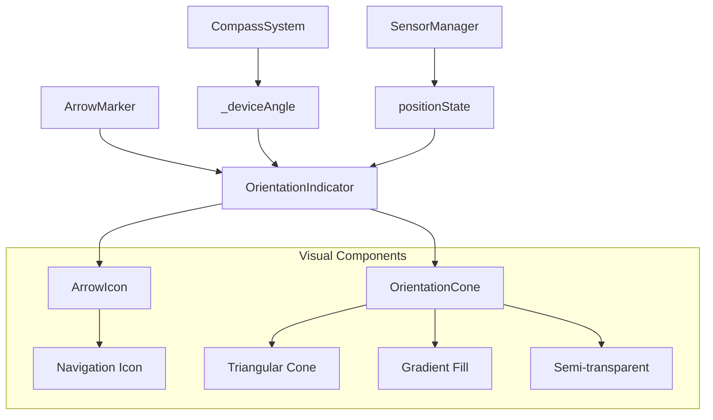

# Agregar Cono de Orientación a la Flecha de Navegación

## Visión General

Implementar un cono de orientación visual tipo Google Maps para la flecha azul pequeña en el mapa, que resalte claramente hacia dónde está apuntando el teléfono móvil. Esta mejora proporcionará una mejor experiencia de usuario al hacer más intuitiva la navegación y orientación en el mapa.

## Arquitectura del Sistema

### Componente Actual
La flecha de navegación actual se renderiza mediante:
- `_buildArrowMarker()` en `map_screen.dart`
- Usa `Icons.navigation` con rotación basada en `arrowState.rotation`
- Integración con sistema de brújula existente (`_deviceAngle`)

### Arquitectura del Cono de Orientación



## Diseño del Widget de Cono de Orientación

### Estructura del Widget Principal

```dart
class OrientationArrowWidget extends StatelessWidget {
  final ArrowState arrowState;
  final double deviceAngle;
  final bool isTrailPoint;
  
  const OrientationArrowWidget({
    required this.arrowState,
    required this.deviceAngle,
    required this.isTrailPoint,
  });
}
```

### Componente del Cono Visual

| Propiedad | Descripción | Valor |
|-----------|-------------|-------|
| **Forma** | Triángulo isósceles apuntando hacia adelante | 60° de apertura |
| **Longitud** | Extensión desde la flecha | 40px desde el centro |
| **Color Base** | Azul semitransparente | `Colors.blue.withOpacity(0.3)` |
| **Gradiente** | Degradado radial desde el centro | Opaco → Transparente |
| **Bordes** | Contorno sutil | `Colors.blue.withOpacity(0.6)` |

### Modos de Visualización

#### Modo Activo (Flecha Principal)
- **Cono completo**: Visible con gradiente y animación
- **Tamaño**: Proporcional al `scale` de la flecha
- **Color**: Azul vibrante con transparencia
- **Animación**: Pulso sutil para indicar actividad

#### Modo Trail (Puntos de Rastro)
- **Cono reducido**: 50% del tamaño normal
- **Opacidad**: Reducida a 30%
- **Sin animación**: Estático para optimizar rendimiento

## Integración con Sistema Existente

### Modificaciones en `map_screen.dart`

#### 1. Actualización del Método `_buildArrowMarker`

```dart
Marker _buildArrowMarker(ArrowState arrowState, {required bool isTrailPoint}) {
  return Marker(
    point: arrowState.position,
    width: arrowState.size * 1.5, // Aumentar para acomodar el cono
    height: arrowState.size * 1.5,
    child: OrientationArrowWidget(
      arrowState: arrowState,
      deviceAngle: _deviceAngle,
      isTrailPoint: isTrailPoint,
    ),
  );
}
```

#### 2. Nuevo Widget de Orientación

La implementación incluirá:
- **Canvas personalizado** para dibujar el cono
- **Transform.rotate** para orientación correcta
- **AnimatedContainer** para transiciones suaves
- **CustomPainter** para renderizado optimizado

### Cálculos de Orientación

#### Conversión de Ángulos
```dart
double get normalizedDeviceAngle {
  // Convertir de radianes a grados y normalizar (0-360°)
  double degrees = (_deviceAngle * 180 / pi) % 360;
  return degrees < 0 ? degrees + 360 : degrees;
}
```

#### Geometría del Cono
- **Punto origen**: Centro de la flecha
- **Dirección**: `normalizedDeviceAngle`
- **Vértices del triángulo**: Calculados con trigonometría
- **Apertura**: ±30° desde la dirección principal

## Especificaciones Visuales Detalladas

### Dimensiones y Proporciones

| Elemento | Tamaño Base | Escala Dinámica | Máximo |
|----------|-------------|-----------------|---------|
| Flecha | 30px | `arrowState.scale` | 45px |
| Cono Longitud | 40px | `arrowState.scale * 0.8` | 50px |
| Cono Ancho | 60° apertura | Fijo | 60° |
| Borde | 1px | Responsive | 2px |

### Esquema de Colores

#### Colores Primarios
- **Flecha**: `Colors.blue` (sin cambios)
- **Cono Fill**: `Colors.blue.withOpacity(0.25)`
- **Cono Border**: `Colors.blue.withOpacity(0.5)`

#### Estados Visuales
- **Movimiento Activo**: Intensidad completa
- **Estacionario**: Opacidad reducida 70%
- **Baja Confianza**: Parpadeo sutil

### Gradiente y Efectos

```dart
RadialGradient coneGradient = RadialGradient(
  center: Alignment.topCenter, // Desde la flecha
  radius: 1.0,
  colors: [
    Colors.blue.withOpacity(0.4),  // Centro opaco
    Colors.blue.withOpacity(0.1),  // Bordes transparentes
    Colors.transparent,            // Extremos invisibles
  ],
  stops: [0.0, 0.7, 1.0],
);
```

## Optimización de Rendimiento

### Estrategias de Renderizado

#### 1. Custom Painter Cacheable
- **Reutilización**: Cache del path del cono para ángulos similares
- **Precisión**: Redondeo a múltiplos de 5° para optimizar cache
- **Invalidación**: Solo cuando cambia significativamente la orientación

#### 2. Animaciones Eficientes
- **Throttling**: Máximo 30 FPS para animaciones del cono
- **Condicional**: Animación solo cuando `isTrailPoint = false`
- **Dispose**: Limpieza automática de controladores

#### 3. Viewport Culling
- **Renderizado condicional**: Solo conus visibles en pantalla
- **LOD (Level of Detail)**: Simplificación en zoom bajo

### Manejo de Memoria

```dart
class ConePathCache {
  static final Map<int, Path> _pathCache = {};
  static const int maxCacheSize = 72; // Cada 5° = 72 entradas
  
  static Path getConePath(double angle) {
    int cacheKey = (angle / 5).round() * 5; // Redondear a múltiplos de 5°
    return _pathCache[cacheKey] ??= _generateConePath(cacheKey);
  }
}
```

## Integración con Sistemas Existentes

### Sistema de Brújula
- **Fuente de datos**: `_deviceAngle` (ya existente)
- **Frecuencia**: Sincronizada con actualizaciones de brújula (100ms)
- **Filtrado**: Usa filtro pasa-bajos para suavizar movimientos

### Sistema de Animación de Flecha
- **Compatibilidad**: Mantiene `ArrowAnimationHelper` existente
- **Extensión**: Añade propiedades de cono a `ArrowState`
- **Transiciones**: Interpolación suave del ángulo del cono

### Global Sensor Manager
- **Sin cambios**: Usa datos existentes de sensores
- **Optimización**: Reutiliza streams de acelerómetro y magnetómetro
- **Sincronización**: Coordina con actualizaciones de posición

## Casos de Uso y Comportamiento

### Escenarios de Uso

#### 1. Navegación Activa
- **Comportamiento**: Cono completamente visible siguiendo orientación del dispositivo
- **Actualización**: Tiempo real (100ms)
- **Intensidad**: Máxima visibilidad

#### 2. Dispositivo Estacionario
- **Comportamiento**: Cono semi-transparente, orientación estable
- **Actualización**: Reducida (500ms)
- **Indicador**: Pulso sutil cada 2 segundos

#### 3. Movimiento Rápido
- **Comportamiento**: Cono con trail dinámico
- **Animación**: Estela que sigue el movimiento
- **Prioridad**: Rendimiento sobre efectos visuales

### Estados de Error y Fallback

#### Sin Datos de Brújula
- **Fallback**: Usar `arrowState.rotation` como orientación
- **Indicador**: Cono punteado para indicar estimación
- **Recuperación**: Automática cuando sensores estén disponibles

#### Baja Precisión de Sensores
- **Comportamiento**: Cono con borde punteado
- **Opacidad**: Reducida proporcionalmente a la confianza
- **Advertencia**: Indicador visual sutil de baja precisión

## Personalización y Configuración

### Parámetros Configurables

```dart
class OrientationConeConfig {
  final double coneLength;      // Longitud del cono (default: 40px)
  final double coneAngle;       // Apertura del cono (default: 60°)
  final Color baseColor;        // Color base (default: Colors.blue)
  final double baseOpacity;     // Opacidad base (default: 0.25)
  final bool enableAnimation;   // Habilitar animaciones
  final Duration updateRate;    // Frecuencia de actualización
}
```

### Temas Visuales
- **Modo Claro**: Cono azul con sombra sutil
- **Modo Oscuro**: Cono celeste con resplandor
- **Alto Contraste**: Bordes más gruesos y colores saturados

## Métricas de Calidad

### Criterios de Aceptación
- ✅ **Precisión**: ±5° de precisión en orientación
- ✅ **Rendimiento**: <2ms tiempo de renderizado
- ✅ **Memoria**: <50KB uso adicional de memoria
- ✅ **Batería**: <3% incremento en consumo energético
- ✅ **Usabilidad**: Mejora en navegación intuitiva

### Indicadores de Rendimiento
- **FPS Objetivo**: Mantener 60 FPS durante animaciones
- **Latencia**: <100ms desde cambio de orientación a actualización visual
- **Precisión**: Correlación >95% con orientación real del dispositivo

## Testing y Validación

### Casos de Prueba Unitarios
1. **Cálculo de geometría del cono**: Verificar vértices correctos
2. **Normalización de ángulos**: Conversión correcta radianes↔grados
3. **Cache de paths**: Eficiencia de almacenamiento y recuperación
4. **Interpolación de animaciones**: Transiciones suaves

### Pruebas de Integración
1. **Sincronización con brújula**: Tiempo real de actualización
2. **Compatibilidad con trail**: Renderizado correcto en historial
3. **Estados de error**: Fallbacks apropiados
4. **Rendimiento en dispositivos**: Pruebas en hardware variado

### Validación de Usuario
- **A/B Testing**: Comparar navegación con/sin cono
- **Métricas de usabilidad**: Tiempo para orientarse en el mapa
- **Feedback cualitativo**: Encuestas de experiencia usuario