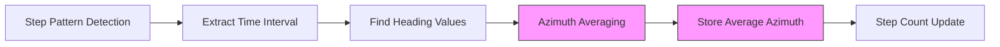

# Azimuth Average (Promedio Azimuth) Feature Design

## Overview

This design document outlines the implementation of an azimuth averaging function in the Flutter-based step detection system. The function calculates a weighted average of azimuth (compass heading) values during the time interval where a step is detected, giving higher weight to more recent values.

## Technology Stack & Dependencies

- **Framework**: Flutter (Dart)
- **Target Module**: `ConteoPasosTexteando` class
- **Dependencies**: 
  - `dart:math` (already imported)
  - Existing heading correlation system (4-row matrix structure)
  - Flutter compass package (`flutter_compass ^0.8.1`)

## Architecture

### Integration Point
The azimuth averaging function will be integrated into the existing step detection pipeline within the `ConteoPasosTexteando` class, leveraging the 4-row matrix structure that already includes heading data correlation.

### Data Flow Integration



### Component Architecture

The azimuth averaging functionality consists of:

1. **Azimuth Averaging Calculator**: Core algorithm adapted from Java to Dart
2. **Heading Data Extractor**: Interface to retrieve correlated heading values
3. **Time Interval Processor**: Maps step timestamps to heading timestamps
4. **Weighted Average Computer**: Implements progressive weighting scheme

## Core Features

### Azimuth Averaging Algorithm

The algorithm implements a weighted averaging scheme that:
- Extracts heading values within step detection time intervals
- Handles azimuth discontinuity (359° to 0° transitions)
- Applies progressive weighting favoring recent values
- Returns weighted average azimuth for each detected step

### Key Algorithm Components

#### 1. Time Interval Mapping
```dart
// Extract time range for detected step
double startTime = matrizDatosAcortada[2][stepStartIndex];
double endTime = matrizDatosAcortada[2][stepEndIndex];
```

#### 2. Heading Data Extraction
```dart
// Get correlated heading values from 4th row
List<double> headingValues = getFilteredHeadingFromExtendedMatrix(matrizDatosExtendida);
List<double> timeValues = matrizDatosExtendida[2]; // Time stamps
```

#### 3. Discontinuity Handling
```dart
// Handle 359° to 0° transitions
if (valuesAbove270 > 0 && valuesBelow90 > 0) {
  // Add 360° to values below 90° for continuity
}
```

#### 4. Progressive Weighting
```dart
// Create progressive weights (1, 2, 3, ..., n)
// Normalize to percentages
// Apply to azimuth values
```

## Data Models & Integration

### Extended Matrix Structure (Already Implemented)
The system leverages the existing 4-row matrix structure:
- Row 0: Symbol data
- Row 1: Magnitude data  
- Row 2: Time data
- Row 3: **Heading data** (correlated with symbols)

### Step Information Enhancement
```dart
class StepInfo {
  double duration;
  double stepLength;
  double averageAzimuth; // New field
  double startTime;
  double endTime;
}
```

## Implementation Details

### Function Signature
```dart
double promedioAzimuth(
  double startTime,
  double endTime,
  List<double> timeArray,
  List<double> azimuthArray,
)
```

### Integration in Step Detection Loop
```dart
// Within the step detection loop in procesar()
if (stepDetected) {
  double tiempo1 = matrizDatosAcortada[2][i];
  double tiempo2 = matrizDatosAcortada[2][i + 4];
  
  // Extract correlated heading data
  List<double> headingData = getFilteredHeadingFromExtendedMatrix(matrizDatosExtendida);
  List<double> timeData = List.from(matrizDatosExtendida[2]);
  
  // Calculate average azimuth for this step
  double averageAzimuth = promedioAzimuth(tiempo1, tiempo2, timeData, headingData);
  
  // Store or use the average azimuth
  // Could be added to matrizPasos or separate tracking
}
```

### Error Handling
- Empty or insufficient data arrays
- Invalid time ranges
- Missing heading correlation data
- Single-value arrays (no averaging needed)

## Algorithm Optimization

### Performance Considerations
- **Time Complexity**: O(n) for each step detection
- **Memory Usage**: Minimal additional allocation
- **Real-time Constraints**: Compatible with 80Hz processing requirement

### Edge Case Handling
1. **Insufficient Data**: Return single value or 0.0
2. **Azimuth Discontinuity**: Automatic 360° adjustment
3. **Time Mismatch**: Graceful degradation with available data
4. **Empty Intervals**: Return default or previous value

## API Reference

### Primary Function
```dart
double promedioAzimuth(
  double startTime,     // Step start time
  double endTime,       // Step end time  
  List<double> timeArray,    // Time stamps array
  List<double> azimuthArray, // Azimuth values array
) {
  // Implementation details...
  return weightedAverageAzimuth;
}
```

### Supporting Methods
```dart
// Extract heading data from matrix
List<double> _extractHeadingInterval(
  double startTime,
  double endTime, 
  List<double> timeArray,
  List<double> headingArray,
);

// Handle azimuth discontinuity
List<double> _normalizeAzimuthValues(List<double> azimuthValues);

// Calculate progressive weights
List<double> _calculateProgressiveWeights(int length);
```

## Testing Strategy

### Unit Tests
- Test azimuth averaging with known input/output pairs
- Test discontinuity handling (359° to 0° transitions)
- Test progressive weighting calculation
- Test edge cases (empty arrays, single values)

### Integration Tests
- Test with real sensor data
- Verify heading-symbol correlation maintained
- Test performance under real-time constraints
- Validate with actual step detection scenarios

### Test Data Sets
```dart
// Test case: Normal azimuth progression
timeArray: [1.0, 2.0, 3.0, 4.0, 5.0]
azimuthArray: [45.0, 50.0, 55.0, 60.0, 65.0]
// Expected: Weighted average favoring later values

// Test case: Discontinuity handling  
azimuthArray: [350.0, 355.0, 0.0, 5.0, 10.0]
// Expected: Proper handling of 359°→0° transition
```

## Integration with Existing Components

### Sensor Data Processing Layer
- Leverages existing 4-row matrix structure
- Uses pre-correlated heading data from sensor processor stage 5
- Maintains compatibility with current data flow

### UI Layer Integration
- Average azimuth could be displayed in sensor cards
- Integration with existing compass display pattern
- Support for both abbreviated (N, NE) and full Spanish names (Norte, Noreste)

### State Management
- Average azimuth values stored alongside step information
- Accessible through existing getter patterns
- Compatible with current UI state management

## Performance & Real-Time Constraints

### Processing Requirements
- Function execution time < 1ms per step
- Memory allocation minimized
- Compatible with 80Hz sensor processing pipeline
- No blocking operations or heavy computations

### Optimization Strategies
- Pre-allocate working arrays where possible
- Use efficient list operations
- Minimize object creation in critical path
- Cache intermediate calculations when beneficial

## Configuration & Customization

### Configurable Parameters
```dart
class AzimuthAveragingConfig {
  static const bool enableProgressiveWeighting = true;
  static const bool handleDiscontinuity = true;
  static const double defaultAzimuth = 0.0;
  static const int minimumDataPoints = 2;
}
```

### Extension Points
- Alternative weighting schemes
- Custom discontinuity handling
- Integration with additional compass features
- Export to data persistence layer