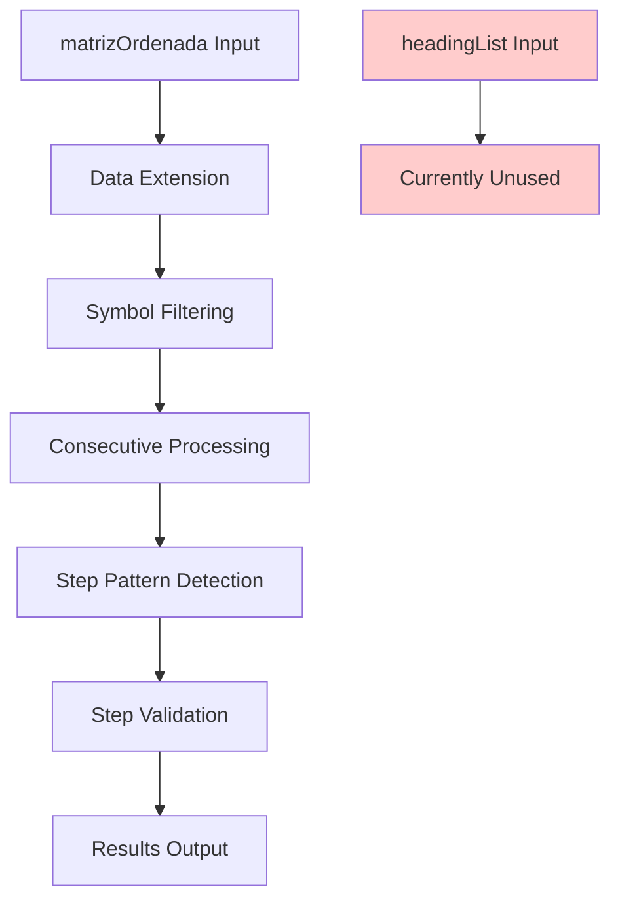
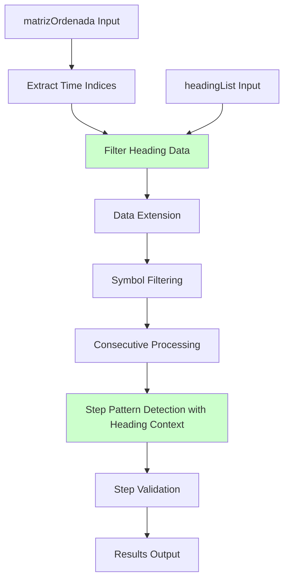
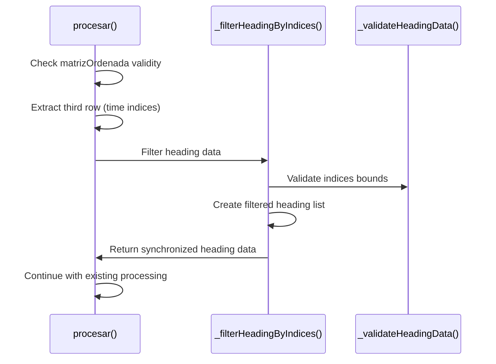
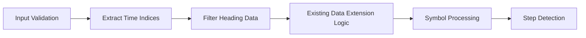
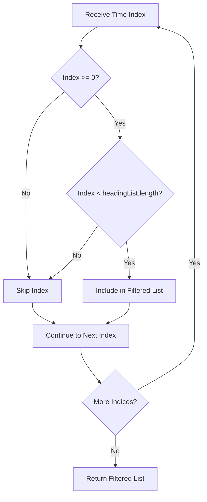

# Heading Data Correlation with MatrizOrdenada Indices

## Overview

This document outlines the design for implementing a heading data filtering mechanism in the `ConteoPasosTexteando` class. The feature will correlate compass heading values with the time indices stored in the third row of `matrizOrdenada`, ensuring that only synchronized heading data is processed during step detection.

## Architecture

### Current State Analysis

The `ConteoPasosTexteando` class currently processes sensor data through the following flow:



### Proposed Architecture Enhancement



## Component Design

### Heading Data Filter Component

The implementation will add a new private method to filter heading data based on matrizOrdenada indices.

#### Method Signature
```dart
List<double> _filterHeadingByIndices(
  List<double> headingList,
  List<double> timeIndices
)
```

#### Algorithm Flow



### Data Correlation Logic

#### Input Validation
- Verify `matrizOrdenada` has at least 3 rows
- Check if third row contains valid time indices
- Ensure `headingList` is not empty
- Validate index bounds to prevent runtime errors

#### Filtering Algorithm
```mermaid
flowchart TD
    A[Start: headingList + timeIndices] --> B[Initialize filteredHeading]
    B --> C[For each index in timeIndices]
    C --> D{Is index valid?}
    D -->|Yes| E[Add headingList[index] to filtered]
    D -->|No| F[Skip invalid index]
    E --> G{More indices?}
    F --> G
    G -->|Yes| C
    G -->|No| H[Return filteredHeading]
```

#### Index Matching Strategy
- **Direct Index Matching**: Use time indices from `matrizOrdenada[2]` as direct array indices into `headingList`
- **Bounds Checking**: Ensure indices fall within `[0, headingList.length - 1]`
- **Error Handling**: Skip invalid indices rather than throwing exceptions

## Implementation Details

### Method Implementation

```dart
List<double> _filterHeadingByIndices(
  List<double> headingList,
  List<double> timeIndices,
) {
  final List<double> filteredHeading = [];
  
  for (final timeIndex in timeIndices) {
    final int index = timeIndex.toInt();
    
    // Validate index bounds
    if (index >= 0 && index < headingList.length) {
      filteredHeading.add(headingList[index]);
    }
    // Skip invalid indices silently
  }
  
  return filteredHeading;
}
```

### Integration Points

#### Modified procesar() Method Flow

1. **Early Validation**: Check `matrizOrdenada` structure
2. **Time Index Extraction**: Extract third row as time indices
3. **Heading Filtering**: Apply correlation filter
4. **Existing Processing**: Continue with current logic using filtered data



### Data Structure Modifications

#### New Internal Variables
```dart
// Add to class-level variables
List<double> _filteredHeadingData = [];
```

#### Modified Method Signature
The `procesar` method signature remains unchanged to maintain compatibility, but internal processing is enhanced.

## Data Flow Architecture

### Input Data Correlation

```mermaid
graph TD
    subgraph "Input Data"
        A[matrizOrdenada<br/>Row 0: Symbols<br/>Row 1: Magnitudes<br/>Row 2: Time Indices]
        B[headingList<br/>Compass readings by sample]
    end
    
    subgraph "Correlation Process"
        C[Extract Time Indices<br/>matrizOrdenada[2]]
        D[Match Indices<br/>headingList[index]]
        E[Create Filtered List<br/>synchronized heading data]
    end
    
    subgraph "Processing Pipeline"
        F[Enhanced Step Detection<br/>with heading context]
        G[Pattern Matching<br/>with spatial awareness]
        H[Step Validation<br/>improved accuracy]
    end
    
    A --> C
    B --> D
    C --> D
    D --> E
    E --> F
    F --> G
    G --> H
```

### Memory Management

#### Efficient Filtering Strategy
- **In-Place Operations**: Minimize memory allocation
- **Lazy Evaluation**: Filter only when needed
- **Bounds Safety**: Prevent index out of bounds exceptions

#### Performance Considerations
- **Time Complexity**: O(n) where n = number of time indices
- **Space Complexity**: O(m) where m = number of valid indices
- **Memory Impact**: Minimal additional overhead

## Integration with Existing Components

### Compatibility Matrix

| Component | Impact | Modification Required |
|-----------|--------|----------------------|
| `procesar()` method | Enhanced | Internal logic addition |
| Data extension logic | None | No changes |
| Symbol filtering | None | No changes |
| Step pattern detection | Enhanced | Optional heading context |
| Gyroscope validation | None | No changes |

### Backward Compatibility

The enhancement maintains full backward compatibility:
- Method signatures remain unchanged
- Existing functionality is preserved
- New filtering is additive, not replacing

## Error Handling Strategy

### Invalid Index Management


### Graceful Degradation
- **Empty Results**: Return empty list if no valid indices
- **Partial Data**: Process available valid indices
- **Logging**: Optional debug information for invalid indices

## Testing Strategy

### Unit Test Cases

#### Data Correlation Tests
```dart
// Test case 1: Normal operation
matrizOrdenada = [[1,2,3], [0.5,1.0,1.5], [0,2,4]]
headingList = [10.0, 20.0, 30.0, 40.0, 50.0]
expected_filtered = [10.0, 30.0, 50.0] // indices 0,2,4

// Test case 2: Out of bounds indices
matrizOrdenada = [[1,2], [0.5,1.0], [1,10]]
headingList = [10.0, 20.0, 30.0]
expected_filtered = [20.0] // only index 1 is valid

// Test case 3: Empty inputs
matrizOrdenada = [[], [], []]
headingList = []
expected_filtered = []
```

#### Edge Case Validation
- Negative indices in time array
- Floating point indices (should be converted to int)
- Empty matrizOrdenada or headingList
- Mismatched data sizes

### Integration Testing

#### Sensor Data Pipeline Tests
- Real sensor data correlation
- Performance under continuous processing
- Memory usage validation
- Accuracy improvement measurement

## Performance Impact Assessment

### Computational Overhead
- **Additional Operations**: Index extraction and bounds checking
- **Time Complexity**: Linear with respect to time indices count
- **Memory Usage**: Proportional to filtered data size

### Optimization Opportunities
- **Batch Processing**: Process multiple windows efficiently
- **Index Caching**: Cache valid indices for repeated use
- **Early Termination**: Stop processing on invalid data patterns

## Future Enhancement Possibilities

### Advanced Correlation Features
- **Temporal Window Matching**: Match heading data within time windows
- **Interpolation Support**: Handle missing heading data
- **Multi-Sensor Fusion**: Integrate additional sensor streams

### Adaptive Filtering
- **Dynamic Threshold Adjustment**: Adapt filtering based on data quality
- **Statistical Validation**: Use heading data distribution for quality assessment
- **Predictive Correlation**: Anticipate heading values for missing indices


