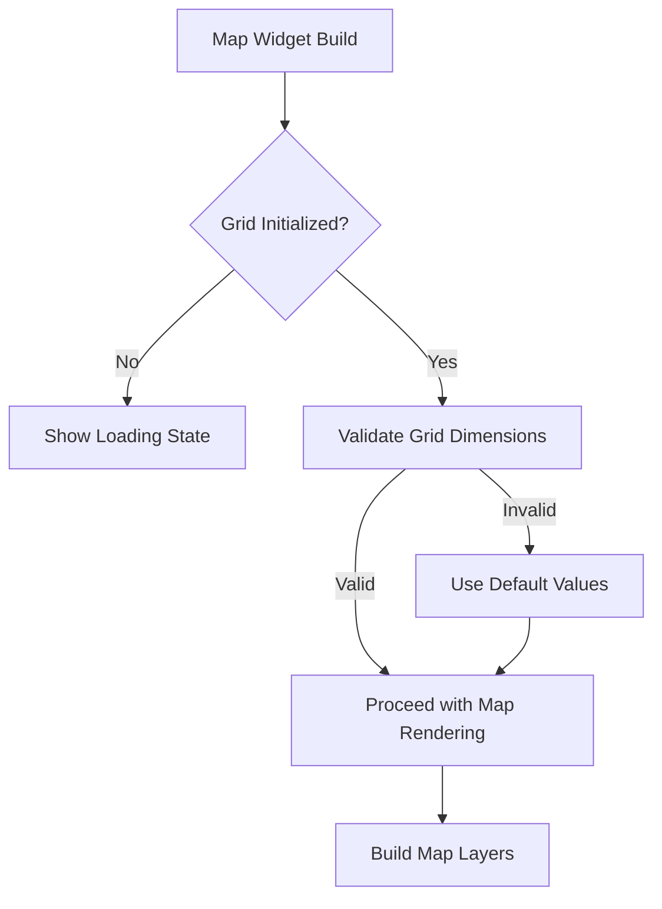
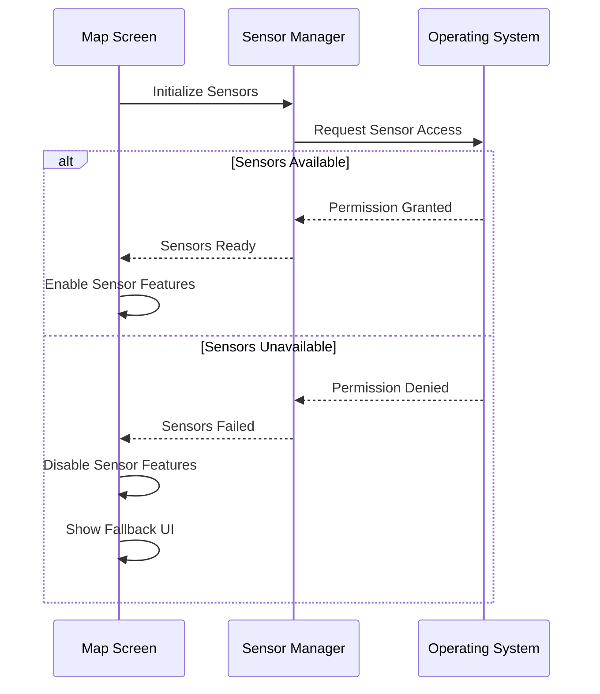
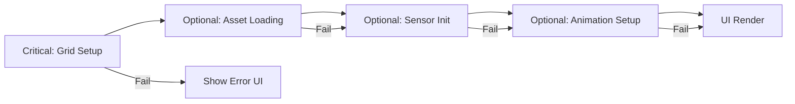
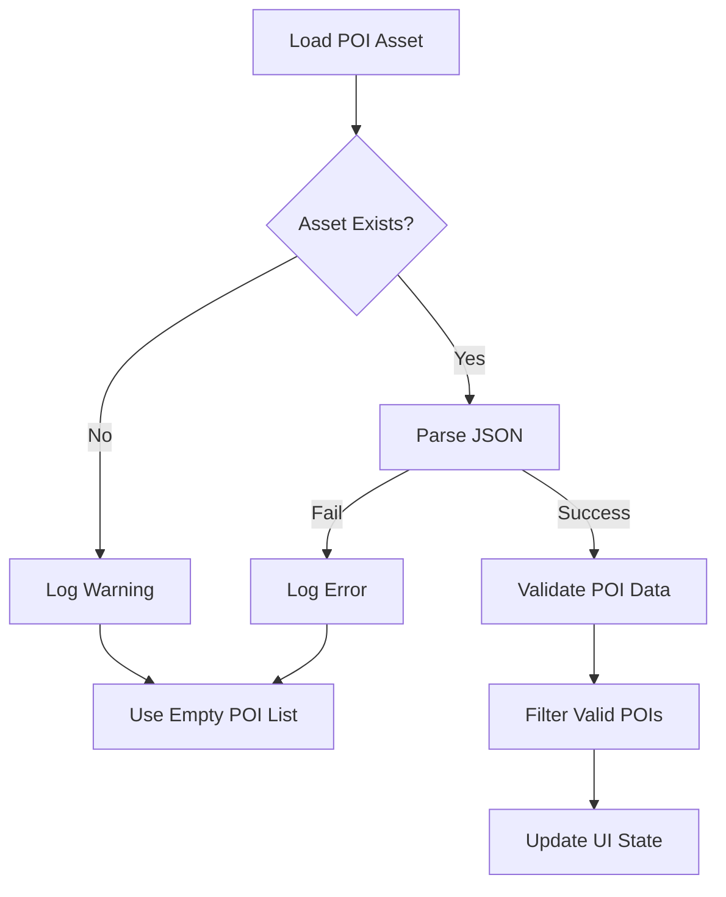

# Map Screen Error Correction Design

## Overview

This design document addresses critical errors in the `map_screen.dart` file that prevent proper initialization and functionality of the map interface. The errors include null safety violations, improper package usage, missing error handling, and incorrect dependency initialization patterns.

## Architecture

### Error Categories Identified

#### 1. Null Safety Violations
- **Problem**: Late-initialized variables not properly handled
- **Impact**: Runtime null reference exceptions
- **Areas Affected**: Grid metrics, sensor data, animations

#### 2. Package Compatibility Issues  
- **Problem**: flutter_map package usage inconsistencies
- **Impact**: Map rendering failures, deprecated API usage
- **Areas Affected**: FlutterMap widget configuration, overlay handling

#### 3. Initialization Race Conditions
- **Problem**: Components initialized in incorrect order
- **Impact**: Failed state dependencies, partial functionality
- **Areas Affected**: Sensors, grid, POIs, animations

#### 4. Memory Management Issues
- **Problem**: Improper disposal of resources
- **Impact**: Memory leaks, performance degradation
- **Areas Affected**: Animation controllers, stream subscriptions

## Critical Error Fixes

### Fix 1: Grid Initialization Safety

**Current Problem:**
- Grid variables (`numRows`, `numCols`, `latStep`, `lngStep`) are declared as `late` but not safely initialized
- Grid bounds validation missing before calculations

**Solution:**
- Add proper initialization checks in `_recomputeGridMetrics()`
- Implement fallback values for grid dimensions
- Add grid validation before UI rendering

### Fix 2: Package Version Compatibility

**Current Problem:**
- flutter_map ^6.1.0 API usage inconsistencies
- Deprecated overlay methods and map controller access

**Solution:**
- Update to latest flutter_map API patterns
- Replace deprecated `OverlayImageLayer` with `TileLayer` or compatible overlay
- Fix map controller camera access patterns

### Fix 3: Sensor Initialization Error Handling

**Current Problem:**
- OptimizedSensorManager initialization not properly error-handled
- Sensor data access without null checks

**Solution:**
- Wrap sensor initialization in try-catch blocks
- Provide fallback functionality when sensors unavailable
- Add sensor permission checking

### Fix 4: Animation Controller Memory Leaks

**Current Problem:**
- Shared animation controller not properly disposed
- Multiple animation controllers created without cleanup

**Solution:**
- Implement proper disposal pattern for animation controllers
- Use single shared controller with reference counting
- Add lifecycle management for animations

## Data Models & Validation

### POI Data Validation

| Field | Validation Rule | Error Handling |
|-------|----------------|----------------|
| `cell.x` | `0 <= x < numRows` | Skip invalid POI |
| `cell.y` | `0 <= y < numCols` | Skip invalid POI |  
| `name` | Non-empty string | Use default name |
| `description` | Any string | Use empty default |

### Grid Bounds Validation

| Parameter | Valid Range | Fallback Value |
|-----------|-------------|----------------|
| `latStep` | `> 0.0001` | `0.001` |
| `lngStep` | `> 0.0001` | `0.001` |
| `numRows` | `> 0 && < 1000` | `400` |
| `numCols` | `> 0 && < 1000` | `400` |

## Error Recovery Mechanisms

### Progressive Initialization Pattern

**Implementation Strategy:**
1. **Critical Components**: Must succeed for basic functionality
   - Grid metrics calculation
   - Map bounds validation
   
2. **Optional Components**: Enhance functionality but not required
   - POI loading
   - Sensor integration  
   - Animations
   - Background processing

3. **Fallback Strategy**: Progressive degradation of features
   - Missing POIs → Show map without POIs
   - No sensors → Disable compass tracking
   - Failed animations → Use static icons

### Asset Loading Safety

**Problem**: JSON asset loading can fail silently

**Solution:**
- Pre-validate asset existence
- Implement retry mechanism with exponential backoff
- Provide empty data fallbacks

## Testing Strategy

### Unit Test Categories

1. **Grid Calculation Tests**
   - Boundary validation
   - Coordinate conversion accuracy
   - Invalid input handling

2. **Initialization Tests**
   - Component loading order
   - Error recovery scenarios
   - Resource cleanup

3. **Sensor Integration Tests**
   - Permission handling
   - Data validation
   - Error scenarios

### Error Simulation Tests

| Scenario | Test Method | Expected Behavior |
|----------|-------------|-------------------|
| Invalid Grid Bounds | Mock invalid coordinates | Use fallback values |
| Missing POI Asset | Remove asset file | Show empty POI list |
| Sensor Permission Denied | Mock permission failure | Disable sensor features |
| Memory Pressure | Simulate low memory | Graceful degradation |

## Performance Optimization

### Rendering Performance

- **Viewport Culling**: Only render visible elements
- **Level of Detail**: Reduce grid density at low zoom
- **RepaintBoundary**: Isolate expensive widgets
- **Animation Optimization**: Shared controllers, reduced frequency

### Memory Management

- **Lazy Loading**: Load assets only when needed
- **Object Pooling**: Reuse marker objects
- **Weak References**: Prevent circular references
- **Resource Disposal**: Proper cleanup in dispose()

## Implementation Priority

### Phase 1: Critical Fixes (High Priority)
1. Fix null safety violations in grid initialization
2. Add proper error handling for component initialization  
3. Implement fallback UI for failed initialization
4. Fix package compatibility issues

### Phase 2: Stability Improvements (Medium Priority)
1. Add comprehensive input validation
2. Implement progressive initialization pattern
3. Add asset loading safety mechanisms
4. Improve memory management

### Phase 3: Performance Enhancements (Low Priority)
1. Optimize rendering performance
2. Add advanced error recovery
3. Implement diagnostic tools
4. Add comprehensive logging

## Error Prevention Guidelines

### Code Quality Rules

1. **Null Safety**: Always check nullable variables before use
2. **Initialization Order**: Critical components before optional ones
3. **Error Boundaries**: Wrap risky operations in try-catch
4. **Resource Management**: Always dispose resources in dispose()
5. **Input Validation**: Validate all external data sources

### Monitoring Strategy

- **Error Logging**: Comprehensive error tracking
- **Performance Metrics**: Monitor initialization time and memory usage
- **User Experience**: Track feature availability and degradation
- **Debug Information**: Detailed diagnostic information in debug mode