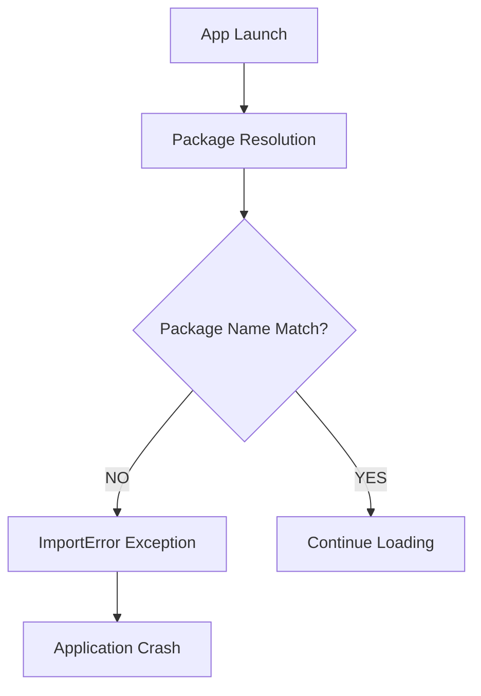
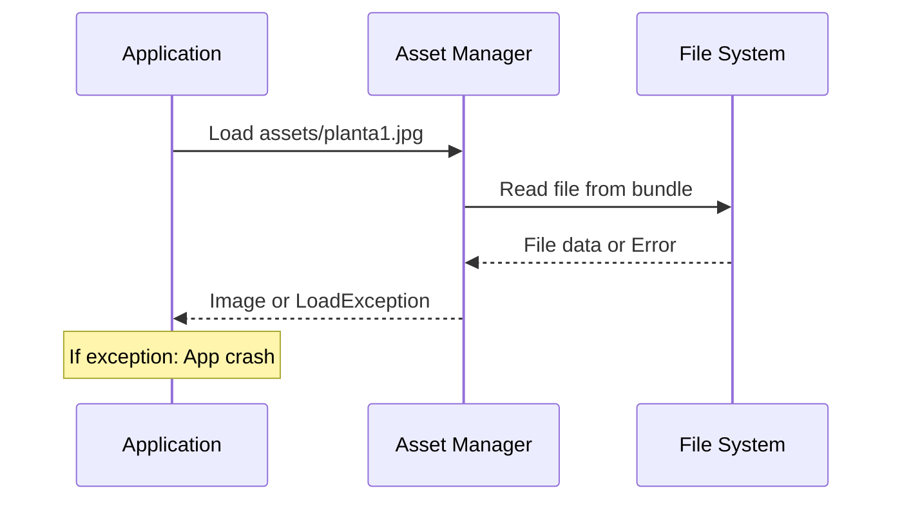
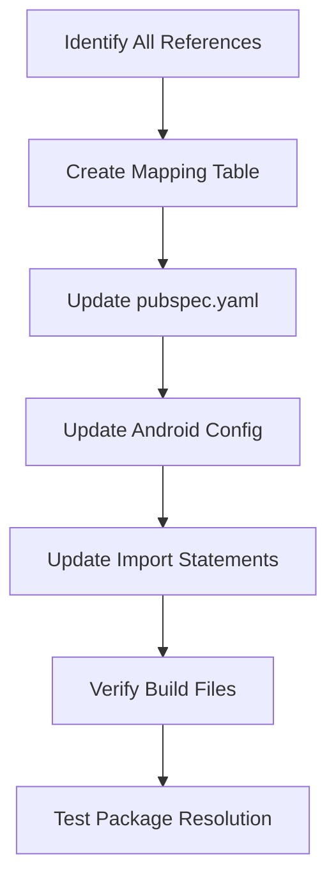
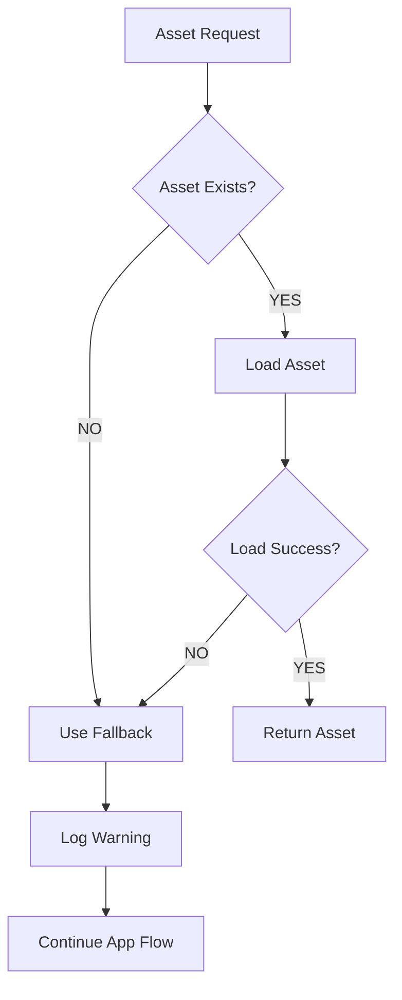
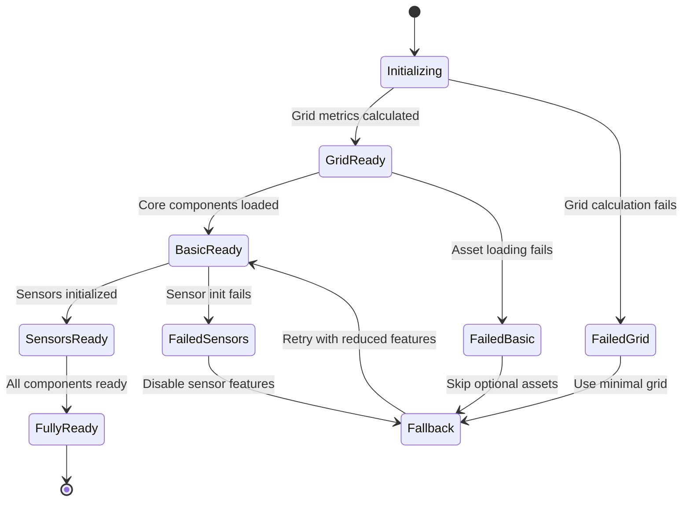
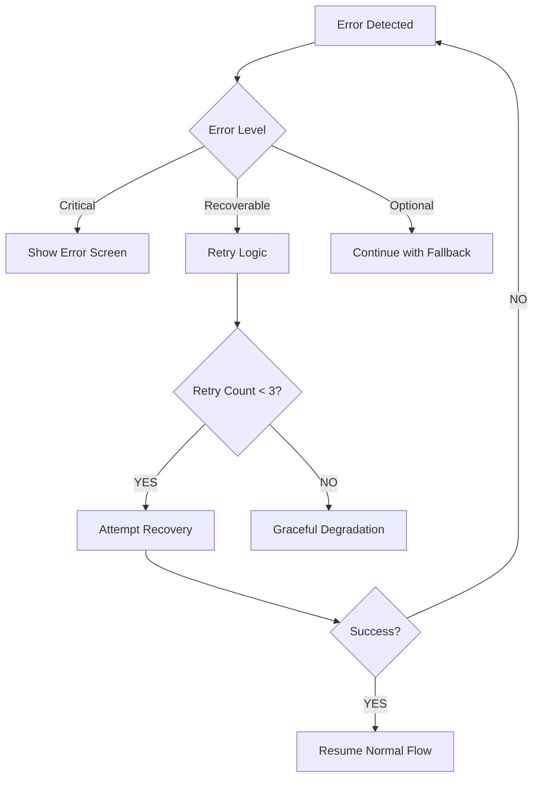

# Application Crash Fix Design Document

## Overview

This document outlines the design and implementation strategy to fix critical corruption issues causing the Flutter IMU step counting application to crash on startup. The analysis identifies several inconsistencies in package naming, missing assets, and initialization problems that prevent the application from launching successfully.

## Technology Stack & Dependencies

- **Framework**: Flutter SDK ^3.7.2
- **Language**: Dart
- **Sensors**: sensors_plus, flutter_compass 
- **Visualization**: fl_chart, flutter_map
- **Storage**: path_provider
- **Core Dependencies**: scidart, latlong2, collection, vector_math

## Root Cause Analysis

### 1. Package Name Inconsistency Issues

#### Problem Identification


**Critical Inconsistencies Found:**
- **pubspec.yaml**: Package name is `proyecto_imu_v1_3`
- **AndroidManifest.xml**: Application label shows `proyecto_imu_v1_2` 
- **Build namespace**: Uses `com.example.proyecto_imu_v1_3`
- **Import statements**: Reference `package:proyecto_imu_v1_3/*`

#### Impact Analysis
- Import resolution failures across 25+ Dart files
- Android build configuration mismatch
- Runtime package lookup errors

### 2. Asset Loading Failures

#### Problem Details
The application references assets that may cause loading issues:
- `assets/planta1.jpg` (702.4KB) - Used for map background
- `assets/plano.jpg` (200.5KB) - Alternative map image  
- `assets/pois.json` (4.9KB) - Points of Interest data

#### Asset Loading Chain


### 3. Map Initialization Complexity

#### Current Implementation Issues
- Complex multi-step initialization process
- Multiple dependent components (Grid, Sensors, POIs, Animations)
- No proper error recovery mechanism
- Synchronous operations blocking UI thread

#### Component Dependencies
```mermaid
graph LR
    A[MapScreen] --> B[Grid Metrics]
    A --> C[Obstacles Loading]
    A --> D[POI Loading]
    A --> E[Sensor Manager]
    A --> F[Animations]
    
    B --> G[D* Lite Algorithm]
    E --> H[Accelerometer]
    E --> I[Gyroscope] 
    E --> J[Magnetometer]
    
    Style A fill:#ff6b6b
    Style G fill:#4ecdc4
```

## Corruption Fix Architecture

### 1. Package Name Standardization Strategy

#### Systematic Approach


#### Implementation Plan

**Phase 1: Core Configuration**
- Standardize package name to `proyecto_imu_v1_3`
- Update Android namespace and application ID
- Fix AndroidManifest.xml label inconsistency

**Phase 2: Import Resolution**
- Audit all 25+ import statements
- Update relative imports to use consistent package name
- Verify dependency resolution

**Phase 3: Build Configuration**
- Update build.gradle.kts files
- Ensure CMakeLists.txt consistency across platforms
- Fix any platform-specific references

### 2. Robust Asset Management System

#### Safe Asset Loading Pattern
```dart
// Defensive asset loading with error handling
class AssetManager {
  static Future<T?> loadAssetSafely<T>(
    String assetPath,
    T Function(dynamic) parser,
  ) async {
    try {
      final data = await rootBundle.load(assetPath);
      return parser(data);
    } catch (e) {
      debugPrint('Asset loading failed: $assetPath - $e');
      return null;
    }
  }
}
```

#### Asset Verification System


### 3. Progressive Map Initialization

#### Initialization State Machine


#### Component Isolation Strategy
- **Critical Components**: Grid metrics, basic UI
- **Optional Components**: Sensors, advanced visualization
- **Fallback Components**: Static display, minimal functionality

### 4. Error Recovery Framework

#### Multi-Level Error Handling


#### Error Categories and Responses

| Error Type | Severity | Response Strategy |
|------------|----------|------------------|
| Package Import Error | Critical | Fix and rebuild |
| Asset Loading Error | Recoverable | Use fallback assets |
| Sensor Init Error | Optional | Continue without sensors |
| Map Init Error | Recoverable | Retry with simpler config |
| Memory Error | Critical | Reduce complexity |

## Implementation Strategy

### 1. Immediate Fixes (Priority 1)

**Package Name Standardization**
- Fix AndroidManifest.xml label: `proyecto_imu_v1_2` → `proyecto_imu_v1_3`
- Verify all import statements use correct package name
- Test import resolution

**Basic Error Handling**
- Add try-catch blocks around critical initialization
- Implement fallback UI for failed components
- Add error logging and user feedback

### 2. Asset Management Improvements (Priority 2)

**Defensive Loading**
- Implement asset existence verification
- Add fallback for missing map images
- Create mock POI data for development

**Performance Optimization**
- Lazy load non-critical assets
- Implement asset caching
- Reduce memory footprint of large images

### 3. Map Initialization Refactoring (Priority 3)

**Progressive Loading**
- Break initialization into independent steps
- Implement async loading with progress indicators
- Add component isolation for better error recovery

**State Management**
- Implement proper state tracking
- Add initialization status reporting
- Create recovery mechanisms for failed states

## Testing Strategy

### 1. Integration Testing

**Package Resolution Tests**
- Verify all imports resolve correctly
- Test cross-platform package consistency
- Validate build process completion

**Asset Loading Tests**
- Test asset loading under various conditions
- Verify fallback mechanisms work
- Test with missing or corrupted assets

### 2. Error Simulation Testing

**Failure Scenarios**
- Simulate network failures
- Test with insufficient permissions
- Simulate sensor unavailability
- Test memory pressure conditions

**Recovery Validation**
- Verify graceful degradation works
- Test retry mechanisms
- Validate user experience during errors

## Performance Considerations

### 1. Memory Management
- Reduce asset memory footprint
- Implement lazy loading patterns
- Add proper disposal of resources

### 2. Startup Performance
- Minimize synchronous operations during init
- Implement splash screen with progress indication
- Defer non-critical component loading

### 3. Error Handling Performance
- Fast error detection and classification
- Efficient fallback switching
- Minimal overhead for error monitoring

## Validation Criteria

### 1. Application Startup Success
- App launches without crashes
- UI renders correctly in all scenarios
- Error states display appropriately

### 2. Feature Functionality
- Core features work with and without sensors
- Map displays correctly with available assets
- Navigation remains functional during partial failures

### 3. Error Recovery
- Application recovers from transient errors
- User experience remains acceptable during failures
- Error messages are informative and actionable