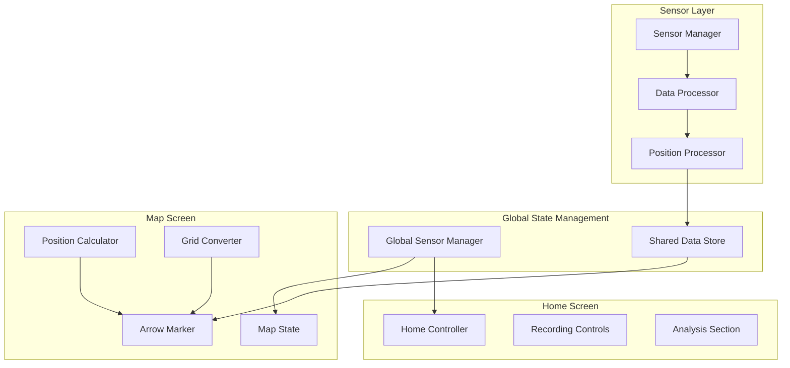
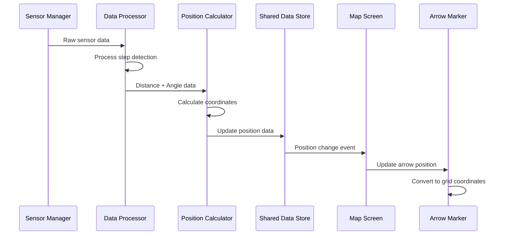
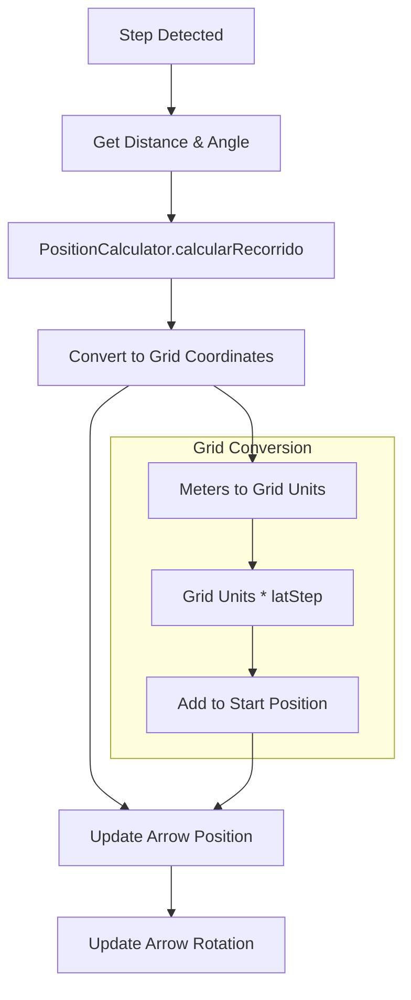
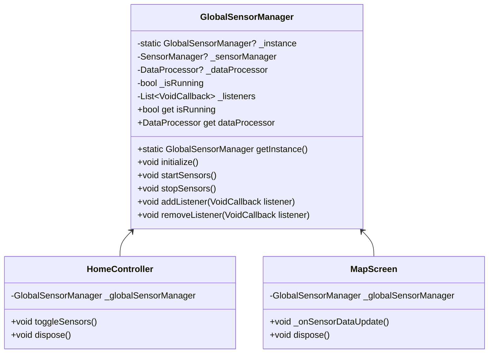
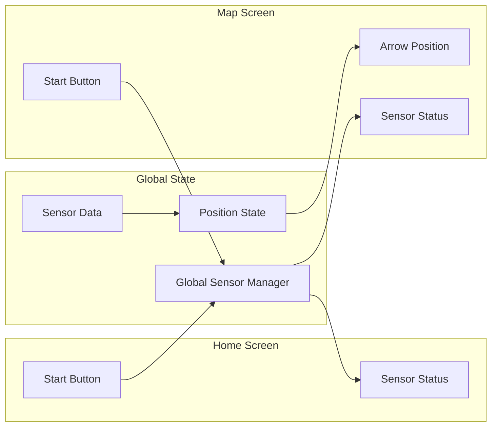

# Main Screen Arrow Animation Design

## Overview

This design addresses the implementation of dynamic arrow movement in the map interface based on step distance and angle calculations, and the synchronization of sensor controls between home and map screens to maintain continuous sensor operation during navigation.

## Architecture

### Component Architecture



### Data Flow Architecture



## Arrow Movement Implementation

### Position Calculation System

The arrow movement will be based on the existing `PositionCalculator` utility that converts distance and angle data to cartesian coordinates:

#### Grid Coordinate System
- Each grid square represents 10cm x 10cm (0.1m x 0.1m)
- Grid conversion formula: `position_in_meters / 0.1 = grid_units`
- Origin point: Initial position when sensors start

#### Position Update Process



### Arrow Position Updates

The arrow position will be updated using the accumulated position data from `PositionCalculator`:

#### Position Conversion Logic
1. **Get Position Data**: Extract final position from `obtenerPosicionFinal()`
2. **Convert to Grid**: Transform meters to grid coordinates using 10cm scale
3. **Update LatLng**: Convert grid position to map coordinates
4. **Update Marker**: Refresh arrow marker position

#### Implementation Details

**Position Data Source:**
- Distance: `dataProcessor.longitudDePasosList`
- Angles: `dataProcessor.conteoPasos.averageAzimuthPerStep`
- Calculation: `PositionCalculator.calcularRecorrido()`

**Grid Conversion:**
```
grid_x = position_x_meters / 0.1  // Convert to 10cm units
grid_y = position_y_meters / 0.1  // Convert to 10cm units
lat = startBounds.latitude + (grid_y * latStep)
lng = startBounds.longitude + (grid_x * lngStep)
```

**Arrow Rotation:**
- Current angle from: `_deviceAngle` (compass-based)
- Movement direction: Last calculated azimuth from step data

## Sensor Synchronization

### Global Sensor Manager Design



### Sensor State Persistence

The sensor state will be maintained across screen transitions using a singleton pattern:

#### Key Components
1. **Global Sensor Manager**: Singleton instance managing sensor lifecycle
2. **Shared Data Store**: Central repository for sensor data and position
3. **Event Listeners**: Notification system for UI updates across screens

#### Button Synchronization
- Home screen "INICIAR SENSORES" button
- Map screen "Iniciar" button
- Both buttons will control the same global sensor instance
- Button states will reflect global sensor status

### Cross-Screen Communication



## Implementation Strategy

### Phase 1: Global Sensor Manager

1. **Create Singleton Sensor Manager**
   - Extract sensor management logic to global singleton
   - Implement listener pattern for UI updates
   - Ensure proper lifecycle management

2. **Update Home Controller**
   - Replace local sensor manager with global instance
   - Maintain existing UI functionality
   - Add listener for sensor state changes

3. **Update Map Screen**
   - Replace local optimized sensor manager with global instance
   - Implement sensor data listener for arrow updates
   - Synchronize button states

### Phase 2: Arrow Position System

1. **Position Data Integration**
   - Access position data from global sensor manager
   - Implement real-time position updates
   - Add grid coordinate conversion logic

2. **Arrow Marker Enhancement**
   - Update marker position based on calculated coordinates
   - Implement smooth position transitions
   - Add position accuracy indicators

3. **Grid Scale Implementation**
   - Apply 10cm grid scale conversion
   - Ensure accurate distance representation
   - Add visual grid reference indicators

### Phase 3: Real-time Updates

1. **Position Streaming**
   - Implement real-time position updates
   - Add position validation and error handling
   - Optimize update frequency for performance

2. **Arrow Animation**
   - Add smooth movement transitions
   - Implement rotation based on movement direction
   - Add position trail visualization

## Testing Strategy

### Unit Testing
- **Position Calculator**: Test grid conversion accuracy
- **Global Sensor Manager**: Test singleton behavior and lifecycle
- **Arrow Updates**: Test position calculation and marker updates

### Integration Testing
- **Screen Transitions**: Verify sensor state persistence
- **Button Synchronization**: Test cross-screen button state consistency
- **Real-time Updates**: Validate arrow movement accuracy

### Performance Testing
- **Position Update Frequency**: Test optimal update rates
- **Memory Usage**: Monitor singleton instance memory footprint
- **UI Responsiveness**: Ensure smooth arrow animations

## Security and Performance

### Performance Considerations
- **Update Throttling**: Limit position updates to prevent UI lag
- **Memory Management**: Proper cleanup of listeners and sensor data
- **Battery Optimization**: Efficient sensor usage patterns

### Error Handling
- **Sensor Failures**: Graceful degradation when sensors unavailable
- **Position Errors**: Validation and correction of position data
- **Screen Transitions**: Recovery from interrupted sensor sessions

## Data Models

### Position State Model
```dart
class PositionState {
  final double x;           // X coordinate in meters
  final double y;           // Y coordinate in meters
  final double angle;       // Current heading in degrees
  final double accuracy;    // Position accuracy estimate
  final DateTime timestamp; // Last update timestamp
}
```

### Sensor State Model
```dart
class SensorState {
  final bool isRunning;
  final double frequency;
  final int stepCount;
  final double totalDistance;
  final List<double> distances;
  final List<double> angles;
}
```

### Arrow State Model
```dart
class ArrowState {
  final LatLng position;      // Current map position
  final double rotation;      // Arrow rotation angle
  final bool isVisible;       // Visibility state
  final double confidence;    // Position confidence
}
```