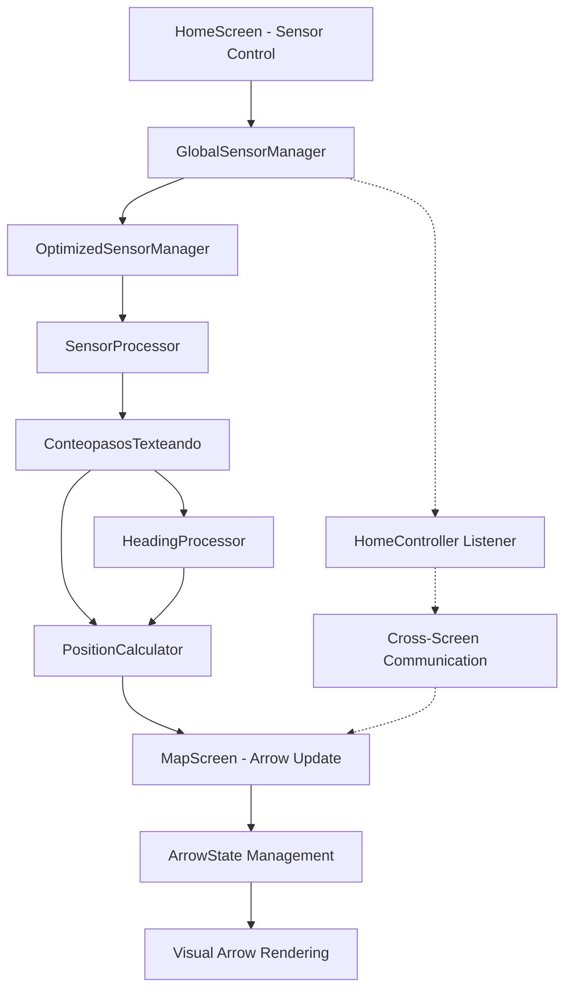
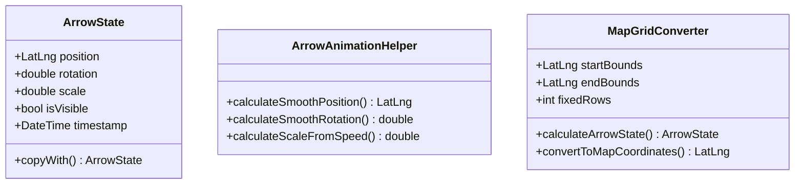
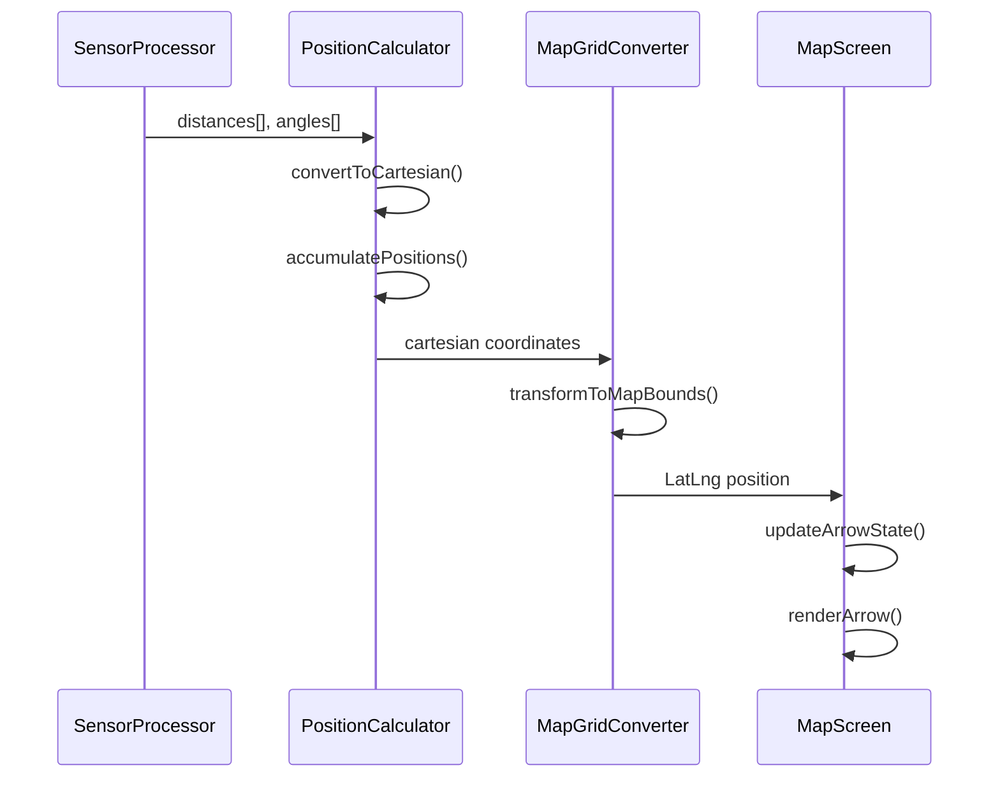
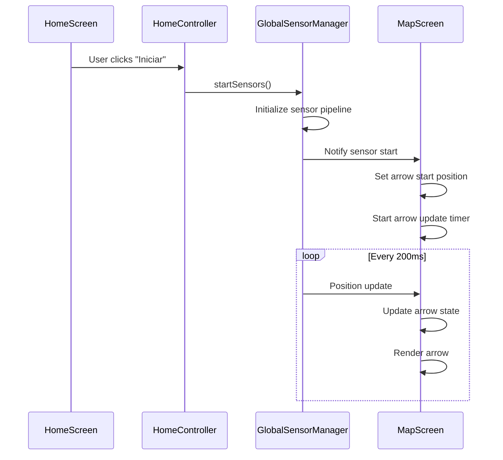

# Blue Arrow Movement Feature Design

## Overview

This feature enables the blue arrow on the map to move dynamically based on distance and angle data obtained from sensor processing in the home screen. The arrow will track user movement in real-time using IMU sensor data processed through the existing sensor pipeline.

## Architecture

### Component Interaction Flow



### Data Flow Architecture

The system follows a producer-consumer pattern:

- **Producer**: Sensor processing pipeline generates step distances and heading angles
- **Consumer**: Map screen consumes position updates to move the blue arrow
- **Communication**: Global sensor manager acts as the bridge between screens

## Core Components

### 1. Arrow State Management



### 2. Position Update Pipeline

The arrow movement integrates with the existing sensor processing system:

#### Sensor Data Processing
- **Step Detection**: Uses `ConteopasosTexteando` for step counting
- **Distance Calculation**: Applies stride length estimation algorithms
- **Heading Processing**: Uses `HeadingProcessor` for azimuth calculations
- **Position Fusion**: Leverages `PositionCalculator` for coordinate transformation

#### Real-time Updates
- **Update Frequency**: 200ms intervals via timer
- **Smooth Animation**: Linear interpolation between positions
- **Trail Visualization**: Maintains arrow path history (max 100 points)

### 3. Map Integration

#### Coordinate System Transformation



#### Grid-Based Positioning
- **Coordinate Bounds**: Utilizes existing map bounds (startBounds, endBounds)
- **Grid Resolution**: Integrates with current 400x400 grid system
- **Position Mapping**: Converts sensor coordinates to map coordinates

## Implementation Strategy

### Phase 1: Arrow State Infrastructure

#### ArrowState Model
```dart
class ArrowState {
  final LatLng position;
  final double rotation;        // Radians
  final double scale;          // 0.5 to 2.0
  final bool isVisible;
  final DateTime timestamp;
  
  ArrowState copyWith({
    LatLng? position,
    double? rotation,
    double? scale,
    bool? isVisible,
  });
}
```

#### Animation Helper
```dart
class ArrowAnimationHelper {
  static LatLng calculateSmoothPosition(
    LatLng current, 
    LatLng target, 
    double lerpFactor
  );
  
  static double calculateSmoothRotation(
    double currentAngle, 
    double targetAngle, 
    double lerpFactor
  );
  
  static double calculateScaleFromSpeed(double speedMs);
}
```

### Phase 2: Grid Converter Implementation

#### MapGridConverter Class
```dart
class MapGridConverter {
  final LatLng startBounds;
  final LatLng endBounds;
  final int fixedRows;
  late final int numCols;
  late final double latStep;
  late final double lngStep;
  
  ArrowState calculateArrowState(
    PositionState positionState,
    LatLng startPosition,
  );
  
  LatLng convertToMapCoordinates(double x, double y);
}
```

### Phase 3: Map Screen Integration

#### Arrow Update Logic
```dart
void _updateArrowPosition() {
  if (!_globalSensorManager.isRunning || _arrowStartPosition == null) {
    return;
  }
  
  final positionState = _globalSensorManager.positionState;
  
  if (positionState.isValid && positionState.accuracy > 0.1) {
    final newArrowState = _gridConverter.calculateArrowState(
      positionState,
      _arrowStartPosition!,
    );
    
    // Apply smooth transitions
    _currentArrowState = ArrowAnimationHelper.calculateSmoothState(
      _currentArrowState,
      newArrowState,
      0.3, // Lerp factor
      _globalSensorManager.currentSpeed
    );
    
    // Update trail
    _updateArrowTrail();
    
    if (mounted) {
      setState(() {});
    }
  }
}
```

#### Arrow Rendering
```dart
Widget _buildArrowLayer() {
  if (_currentArrowState == null || !_currentArrowState!.isVisible) {
    return Container();
  }
  
  return MarkerLayer(
    markers: [
      Marker(
        point: _currentArrowState!.position,
        builder: (context) => Transform.rotate(
          angle: _currentArrowState!.rotation,
          child: Transform.scale(
            scale: _currentArrowState!.scale,
            child: Icon(
              Icons.navigation,
              color: Colors.blue,
              size: 30,
            ),
          ),
        ),
      ),
    ],
  );
}
```

## Integration Points

### Sensor System Integration

#### Global Sensor Manager Extension
- **Position State**: Add position tracking to `PositionState` model
- **Update Callbacks**: Extend listener system for map updates
- **Data Validation**: Implement accuracy thresholds for position updates

#### Home Controller Modifications
- **Start Position**: Capture initial position when sensors start
- **Reset Logic**: Clear arrow state when sensors stop
- **Cross-Screen Communication**: Notify map screen of sensor state changes

### Map Screen Enhancements

#### Initialization Sequence


#### Error Handling Strategy
- **Sensor Unavailable**: Display message, disable arrow
- **Invalid Position Data**: Use last known valid position
- **Map Bounds Violation**: Clamp position to valid bounds
- **Performance Issues**: Reduce update frequency automatically

## Visual Design

### Arrow Appearance

#### Dynamic Scaling
- **Stationary**: Scale 0.8 (smaller when not moving)
- **Walking**: Scale 1.0 (normal size)
- **Fast Movement**: Scale 1.3 (larger for visibility)

#### Rotation Behavior
- **Smooth Rotation**: 0.4 lerp factor for natural movement
- **Heading Alignment**: Arrow points in movement direction
- **360° Handling**: Normalize angle transitions

#### Trail Visualization
- **Path History**: Semi-transparent blue line
- **Maximum Points**: 100 positions (prevent memory issues)
- **Fade Effect**: Older positions gradually fade out

### User Interface Integration

#### Control Panel Updates
```dart
// Enhanced sensor control button
ElevatedButton.icon(
  onPressed: _toggleSensorsWithArrow,
  icon: Icon(_isRunning ? Icons.stop : Icons.navigation),
  label: Text(_isRunning ? "Detener Navegación" : "Iniciar Navegación"),
  style: ElevatedButton.styleFrom(
    backgroundColor: _isRunning ? Colors.red : Colors.blue,
  ),
)
```

#### Status Indicators
- **Arrow Active**: Blue navigation icon when tracking
- **Position Accuracy**: Real-time accuracy percentage
- **Trail Length**: Number of recorded positions

## Performance Considerations

### Memory Management
- **Trail Limiting**: Maximum 100 arrow positions
- **State Cleanup**: Clear arrow data when sensors stop
- **Efficient Updates**: Only update when position changes significantly

### Rendering Optimization
- **RepaintBoundary**: Isolate arrow rendering from map repaints
- **Conditional Rendering**: Only render when arrow is visible
- **Animation Throttling**: Limit update frequency to 200ms

### Sensor Data Efficiency
- **Accuracy Filtering**: Only process high-accuracy position data
- **Movement Threshold**: Ignore micro-movements (< 0.1m)
- **Background Processing**: Leverage existing background processor

## Testing Strategy

### Unit Testing
- **PositionCalculator**: Verify coordinate transformations
- **ArrowAnimationHelper**: Test smooth transitions
- **MapGridConverter**: Validate bounds and grid calculations

### Integration Testing
- **Sensor Pipeline**: End-to-end data flow testing
- **Cross-Screen Communication**: Verify state synchronization
- **Error Scenarios**: Test sensor failures and recovery

### User Acceptance Testing
- **Real Movement**: Test with actual walking patterns
- **Accuracy Validation**: Compare with known paths
- **Performance Testing**: Verify smooth operation on target devices

## Migration Strategy

### Incremental Rollout
1. **Phase 1**: Implement arrow state models and helpers
2. **Phase 2**: Add grid converter and position mapping
3. **Phase 3**: Integrate with map screen and sensor system
4. **Phase 4**: Add visual enhancements and trail system

### Backward Compatibility
- **Graceful Degradation**: Map functions without arrow if sensors unavailable
- **Feature Flags**: Enable/disable arrow tracking independently
- **Legacy Support**: Maintain existing map functionality unchanged

### Risk Mitigation
- **Sensor Fallback**: Continue functioning without IMU sensors
- **Performance Monitoring**: Real-time performance metrics
- **Memory Safeguards**: Automatic cleanup on memory pressure