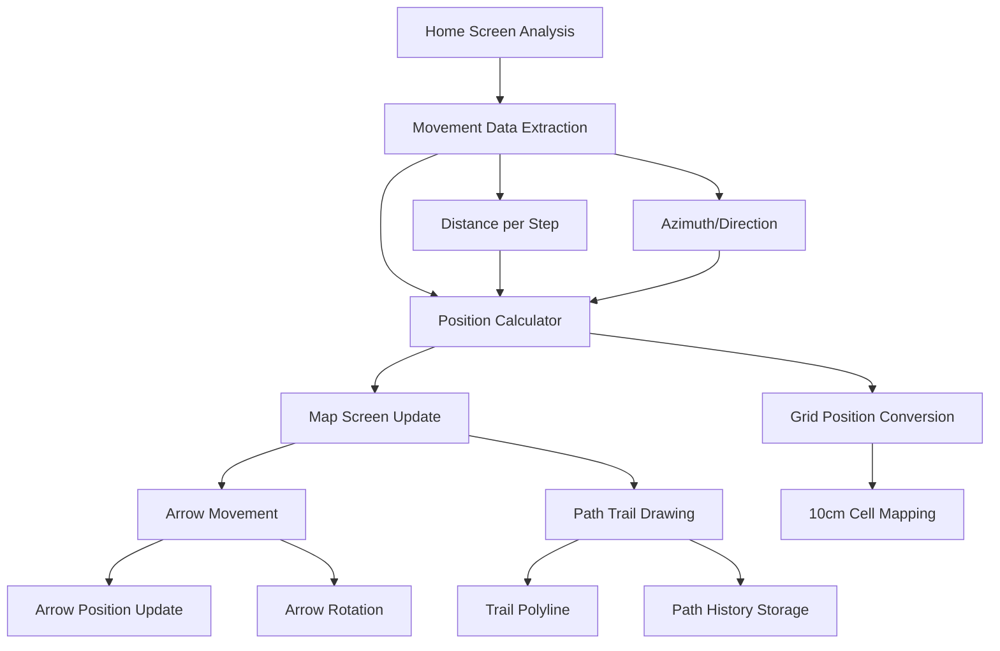
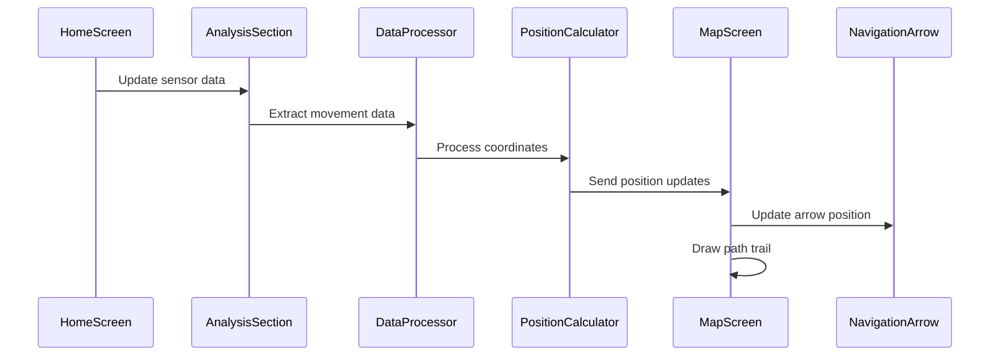

# Navigation Arrow Movement Design

## Overview

This design implements a real-time navigation arrow movement system in the map screen that responds to sensor calculations from the home screen analysis. The blue navigation arrow will move according to distance and direction data obtained from IMU sensors, creating a dynamic path tracing system with a 10cm x 10cm grid scale.

## Architecture

### Current System Analysis
- **Map Screen**: Contains blue navigation arrow with 10cm x 10cm grid system (400x400 cells)
- **Home Screen**: Analysis section provides step count, distance calculations, and azimuth/heading data
- **Data Flow**: Sensor data processed in `DataProcessor` → Analysis widgets → Movement calculations

### Movement Integration Architecture



## Data Integration Layer

### Sensor Data Sources (from Analysis Section)

| Data Source | Component | Description |
|------------|-----------|-------------|
| **Step Count** | `StatCard - Pasos Totales` | Total number of steps detected |
| **Total Distance** | `StatCard - Distancia Total` | Accumulated distance in meters |
| **Step Distances** | `AnalysisListCard - Longitud de Pasos` | Individual step distances in meters |
| **Step Orientations** | `AnalysisListCard - Orientación de Pasos` | Azimuth/heading for each step |
| **Movement Path** | `MovementGraphCard` | 2D movement visualization data |

### Data Flow Architecture



## Component Architecture

### 1. Movement Data Bridge

Create a new service to bridge data between screens:

#### `MovementDataService`
- **Purpose**: Extract and format movement data from analysis widgets
- **Data Structure**:
  ```dart
  class MovementUpdate {
    final double deltaX;        // X displacement in meters
    final double deltaY;        // Y displacement in meters
    final double heading;       // Direction in degrees
    final double stepDistance;  // Current step distance
    final int stepNumber;       // Sequential step number
  }
  ```

#### `NavigationStateManager`
- **Purpose**: Manage arrow position and path history
- **State Management**:
  ```dart
  class NavigationState {
    LatLng currentPosition;
    double currentHeading;
    List<LatLng> pathHistory;
    List<MovementUpdate> movementHistory;
  }
  ```

### 2. Grid Coordinate System

#### Scale Conversion
- **Physical Scale**: 10cm × 10cm per grid cell
- **Conversion Factor**: 1 meter = 10 grid cells
- **Position Mapping**:
  ```dart
  Point<int> metersToGridCells(double meterX, double meterY) {
    return Point(
      (meterX * 10).round(),  // 10 cells per meter
      (meterY * 10).round()
    );
  }
  ```

#### Grid Position Updates
- Convert sensor-calculated positions to grid coordinates
- Map grid coordinates to LatLng for map display
- Maintain position accuracy within cell boundaries

### 3. Arrow Movement System

#### Position Updates
- **Real-time Updates**: Listen to analysis section data changes
- **Smooth Transitions**: Interpolate between positions
- **Heading Rotation**: Update arrow rotation based on movement direction

#### Movement Animation
```dart
class ArrowMovementController {
  // Smooth position transitions
  AnimationController positionController;
  Animation<LatLng> positionTween;
  
  // Rotation animations
  AnimationController rotationController;
  Animation<double> rotationTween;
  
  // Update methods
  void updatePosition(LatLng newPosition);
  void updateHeading(double newHeading);
}
```

### 4. Path Trail System

#### Trail Visualization
- **Path Storage**: Maintain list of arrow positions
- **Trail Rendering**: Draw continuous polyline following arrow movement
- **Trail Styling**: Distinct visual representation with color coding

#### Trail Management
```dart
class PathTrailManager {
  List<LatLng> trailPoints = [];
  
  void addTrailPoint(LatLng position);
  void clearTrail();
  Polyline generateTrailPolyline();
}
```

## UI Components Integration

### Map Screen Enhancements

#### Current Blue Arrow Enhancement
- **Position Binding**: Connect to movement data stream
- **Rotation Updates**: Real-time heading adjustments
- **Visual Feedback**: Enhanced arrow with trail indicator

#### Trail Visualization
- **Trail Polyline**: Continuous path behind arrow
- **Color Scheme**: 
  - Trail: Semi-transparent blue (#2196F3 with 0.6 opacity)
  - Arrow: Solid blue (#1976D2)
  - Trail nodes: Small dots at step positions

#### Navigation UI Elements
```dart
Widget buildNavigationElements() {
  return Stack(
    children: [
      // Trail polyline layer
      PolylineLayer(polylines: [trailPolyline]),
      
      // Navigation arrow marker
      MarkerLayer(markers: [navigationArrow]),
      
      // Step position markers
      MarkerLayer(markers: stepMarkers),
    ],
  );
}
```

### Analysis Section Integration

#### Data Extraction Points
- **Step Counter**: Monitor `pasosTotales` changes
- **Distance Updates**: Track `distanciaTotal` increments
- **Step Details**: Extract from `longitudDePasosList`
- **Orientation Data**: Utilize `averageAzimuthPerStep`

#### Real-time Data Streaming
```dart
class AnalysisDataStream {
  Stream<MovementUpdate> get movementUpdates;
  Stream<NavigationState> get navigationUpdates;
  
  void processAnalysisData(DataProcessor dataProcessor);
}
```

## Movement Calculation Engine

### Position Calculation Algorithm

#### Step-by-Step Processing
1. **Extract Step Data**: Get distance and azimuth from analysis
2. **Convert to Cartesian**: Use existing `PositionCalculator`
3. **Scale to Grid**: Apply 10cm cell scaling
4. **Update Position**: Add displacement to current position
5. **Update Trail**: Add new position to path history

#### Coordinate Transformation
```dart
class MovementCalculator {
  static LatLng calculateNextPosition(
    LatLng currentPosition,
    double stepDistance,
    double azimuth,
    double cellSize, // 10cm in map units
  ) {
    // Convert polar to cartesian coordinates
    final deltaX = stepDistance * cos(azimuth * pi / 180);
    final deltaY = stepDistance * sin(azimuth * pi / 180);
    
    // Scale to grid coordinates
    final gridDeltaX = deltaX / cellSize;
    final gridDeltaY = deltaY / cellSize;
    
    // Apply to current position
    return LatLng(
      currentPosition.latitude + gridDeltaY * latStep,
      currentPosition.longitude + gridDeltaX * lngStep,
    );
  }
}
```

### Real-time Processing

#### Data Synchronization
- **Sensor Frequency**: Match 100Hz sensor data rate
- **Update Throttling**: Limit map updates to 30FPS for performance
- **Buffer Management**: Handle data bursts and timing inconsistencies

#### Movement Validation
- **Boundary Checking**: Ensure movements stay within map bounds
- **Distance Validation**: Verify reasonable step distances
- **Direction Consistency**: Check for abrupt heading changes

## Performance Considerations

### Optimization Strategies

#### Memory Management
- **Trail Point Limit**: Maximum 1000 trail points
- **Circular Buffer**: Automatic cleanup of old trail data
- **Position Caching**: Cache calculated positions to avoid recomputation

#### Rendering Performance
- **Selective Updates**: Only redraw changed elements
- **LOD System**: Simplify trail at high zoom levels
- **Culling**: Hide off-screen trail segments

#### Real-time Processing
```dart
class PerformanceOptimizer {
  static const int maxTrailPoints = 1000;
  static const Duration updateThrottle = Duration(milliseconds: 33); // ~30fps
  
  Timer? _updateTimer;
  
  void throttledUpdate(Function updateFunction) {
    _updateTimer?.cancel();
    _updateTimer = Timer(updateThrottle, () => updateFunction());
  }
}
```

## Testing Strategy

### Movement Accuracy Testing
- **Static Tests**: Verify coordinate calculations
- **Movement Simulation**: Test with known step patterns
- **Real-world Validation**: Compare with actual movement

### Performance Testing
- **Frame Rate**: Maintain 30fps during active movement
- **Memory Usage**: Monitor trail point accumulation
- **Battery Impact**: Measure power consumption increase

### Integration Testing
- **Data Flow**: Verify analysis → movement → display pipeline
- **Error Handling**: Test with invalid sensor data
- **State Persistence**: Test movement state across screen transitions

## Implementation Architecture

### Phase 1: Data Integration
1. Create `MovementDataService` for data extraction
2. Implement `NavigationStateManager` for state management
3. Add real-time data streaming from analysis section

### Phase 2: Movement Engine
1. Implement coordinate conversion algorithms
2. Create smooth arrow movement animations
3. Add heading/rotation updates

### Phase 3: Trail System
1. Implement path trail storage and rendering
2. Add trail visualization with polylines
3. Optimize performance for long trails

### Phase 4: Integration & Polish
1. Integrate all components in map screen
2. Add visual enhancements and feedback
3. Performance optimization and testing

This design provides a comprehensive real-time navigation system that transforms sensor analysis data into dynamic arrow movement with accurate path tracing on the 10cm grid system.