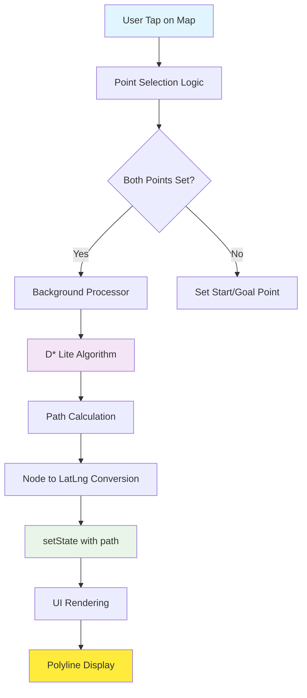
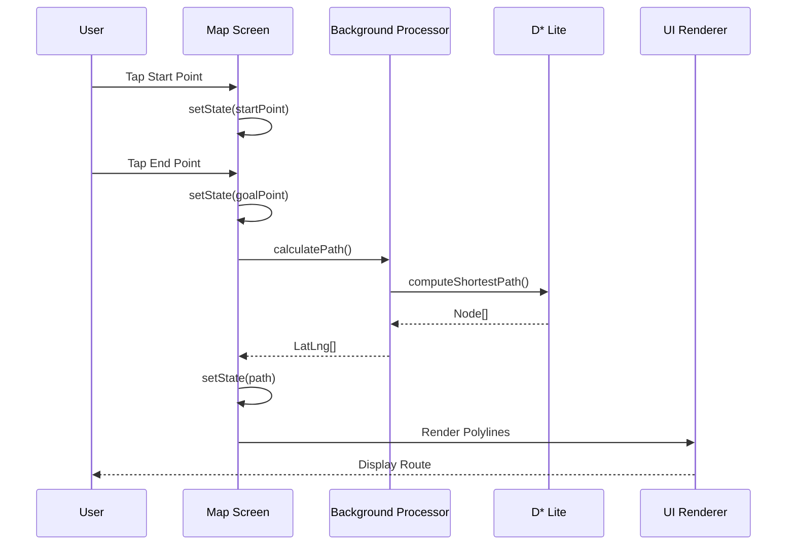
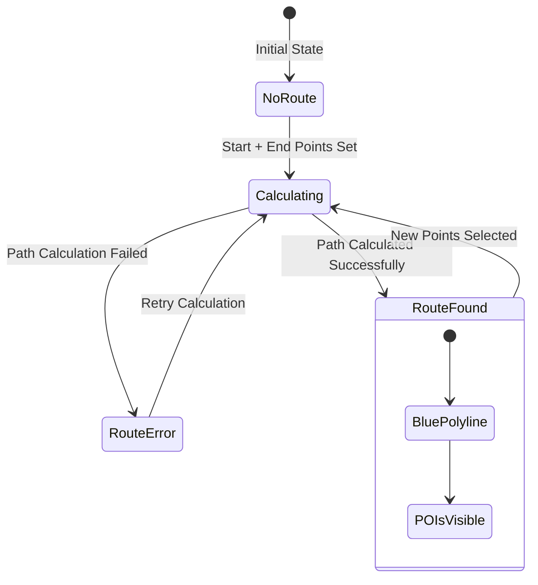

# Route Calculation and Display Issue Resolution

## Overview

This document addresses the critical issue where calculated routes are not displayed properly on the map. The application shows a yellow "Sin ruta" (No route) indicator instead of displaying the blue route line when start and end points are selected.

## Architecture Analysis

### Current System Components



### Component Interaction Flow

| Component | Responsibility | Current State |
|-----------|----------------|---------------|
| **Map Screen** | UI coordination, tap handling | ✓ Working |
| **Background Processor** | Async path calculation | ⚠️ Potential issues |
| **D* Lite Algorithm** | Pathfinding computation | ✓ Working |
| **Grid System** | Coordinate mapping | ✓ Working |
| **Polyline Rendering** | Visual route display | ❌ Not displaying |

## Root Cause Analysis

### Issue Identification

The analysis reveals several potential failure points in the route calculation pipeline:

#### 1. Asynchronous Processing Timing
```dart
// Current problematic flow
Future.microtask(() async {
  await BackgroundProcessor.instance.initialize();
  calculatePath();
});
```

#### 2. State Management Race Conditions
- Multiple `setState()` calls in sequence
- Path clearing before route calculation completes
- Background processor initialization timing

#### 3. Coordinate System Validation
- Grid bounds validation
- LatLng to grid coordinate conversion
- Node walkability verification

### Critical Path Analysis



## Solution Architecture

### Enhanced Route Calculation System

#### 1. Synchronous Path Calculation Flow
```dart
void calculatePath() async {
  try {
    // Clear previous path immediately
    setState(() => path = []);
    
    // Validate prerequisites
    if (!_validatePathCalculationPreconditions()) return;
    
    // Calculate path with fallback mechanism
    final calculatedPath = await _executePathCalculation();
    
    // Update UI state atomically
    if (calculatedPath.isNotEmpty && mounted) {
      setState(() {
        path = calculatedPath;
        visiblePOIs = _updateVisiblePOIs(calculatedPath);
      });
    }
  } catch (e) {
    _handlePathCalculationError(e);
  }
}
```

#### 2. Robust Validation Pipeline
```dart
bool _validatePathCalculationPreconditions() {
  return startPoint != null && 
         goalPoint != null && 
         _initContext.gridInitialized &&
         _validateGridBounds(startPoint!, goalPoint!);
}
```

#### 3. Enhanced Error Handling
```dart
Future<List<LatLng>> _executePathCalculation() async {
  // Primary: Background processor
  List<Node> nodePath = await BackgroundProcessor.instance.calculatePath(/*...*/);
  
  // Fallback: Direct calculation
  if (nodePath.isEmpty) {
    nodePath = _calculatePathDirect();
  }
  
  // Validation and conversion
  return _convertAndValidatePath(nodePath);
}
```

### UI State Management Improvements

#### 1. Atomic State Updates


#### 2. Visual Feedback Enhancement
```dart
Widget _buildRouteStatusIndicator() {
  return AnimatedContainer(
    duration: Duration(milliseconds: 300),
    padding: EdgeInsets.all(8),
    decoration: BoxDecoration(
      color: _getRouteStatusColor(),
      borderRadius: BorderRadius.circular(8),
    ),
    child: Row(
      mainAxisSize: MainAxisSize.min,
      children: [
        _getRouteStatusIcon(),
        SizedBox(width: 8),
        Text(_getRouteStatusText()),
      ],
    ),
  );
}
```

### Polyline Rendering Optimization

#### 1. Layer Priority System
```dart
List<Polyline> _buildSafePolylines() {
  List<Polyline> polylines = [];
  
  // Layer 1: Route border (white, 8px width)
  if (path.isNotEmpty && path.length > 1) {
    polylines.add(_createRouteBorder());
  }
  
  // Layer 2: Main route (blue, 6px width)
  if (path.isNotEmpty && path.length > 1) {
    polylines.add(_createMainRoute());
  }
  
  // Layer 3: Grid lines (lower priority)
  if (_initContext.gridInitialized) {
    polylines.addAll(buildOptimizedGridLines());
  }
  
  return polylines;
}
```

#### 2. Enhanced Route Styling
```dart
Polyline _createMainRoute() {
  return Polyline(
    points: path,
    color: Colors.blue,
    strokeWidth: 6.0,
    isDotted: false,
    useStrokeWidthInMeter: false,
  );
}
```

## Testing Strategy

### Test Scenarios

| Test Case | Description | Expected Outcome |
|-----------|-------------|------------------|
| **TC-001** | Select start point only | Green marker, "Sin ruta" status |
| **TC-002** | Select start + end points | Blue route line, "Ruta: X puntos" |
| **TC-003** | Select points on obstacles | Error message, no route |
| **TC-004** | Select same start/end cell | Validation error |
| **TC-005** | Background processor failure | Fallback calculation success |

### Validation Checklist

#### Route Calculation
- [ ] Start and end points properly validated
- [ ] Grid initialization verified
- [ ] Node walkability confirmed
- [ ] Path length > 1 points

#### Visual Display
- [ ] Blue polyline rendered
- [ ] Route width = 6px
- [ ] White border visible (8px)
- [ ] Route above grid lines
- [ ] Status indicator shows green

#### Error Handling
- [ ] Graceful fallback to direct calculation
- [ ] User feedback for errors
- [ ] Debug logging comprehensive
- [ ] State consistency maintained

## Performance Considerations

### Memory Management
- Limit visible polylines using viewport culling
- Use RepaintBoundary for map widgets
- Optimize grid line rendering with LOD

### Computational Efficiency
- Background processing for complex calculations
- Caching of frequently accessed data
- Throttled UI updates

## Monitoring and Debugging

### Debug Information Display
```dart
Widget _buildDebugOverlay() {
  return Positioned(
    top: 100,
    right: 16,
    child: Container(
      padding: EdgeInsets.all(8),
      decoration: BoxDecoration(
        color: Colors.black54,
        borderRadius: BorderRadius.circular(8),
      ),
      child: Column(
        crossAxisAlignment: CrossAxisAlignment.start,
        children: [
          Text('Path Length: ${path.length}'),
          Text('Grid: ${_initContext.gridInitialized ? "✓" : "✗"}'),
          Text('Start: ${startPoint != null ? "✓" : "✗"}'),
          Text('Goal: ${goalPoint != null ? "✓" : "✗"}'),
        ],
      ),
    ),
  );
}
```

### Console Logging Strategy
- Route calculation start/end events
- Path coordinate validation
- Polyline creation confirmation
- Error stack traces

## Implementation Roadmap

### Phase 1: Core Fixes
1. Fix state management race conditions
2. Implement atomic path updates
3. Add comprehensive validation
4. Enhance error handling

### Phase 2: UI Improvements
1. Improve visual feedback
2. Add loading indicators
3. Enhance route styling
4. Optimize rendering performance

### Phase 3: Testing and Validation
1. Comprehensive test suite
2. Performance monitoring
3. User acceptance testing
4. Documentation updates

## Risk Mitigation

### Potential Issues
- **Background Processor Failures**: Fallback to direct calculation
- **Memory Leaks**: Proper disposal of streams and controllers
- **Performance Degradation**: Viewport culling and LOD implementation
- **State Inconsistency**: Atomic updates and validation

### Contingency Plans
- Multiple calculation fallbacks
- Graceful degradation modes
- User notification system
- Debug mode for troubleshooting