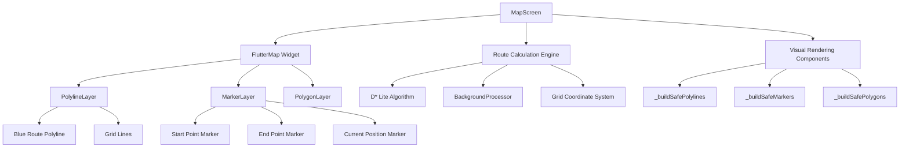
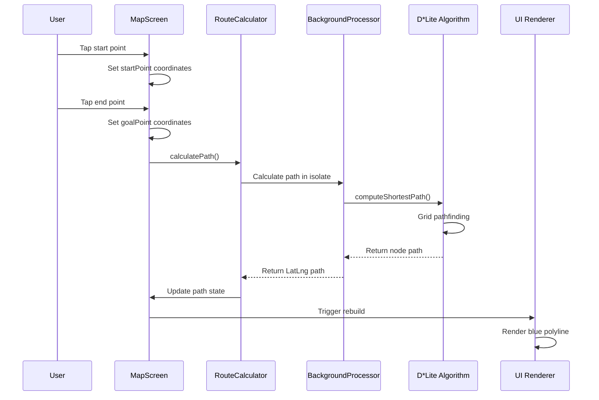
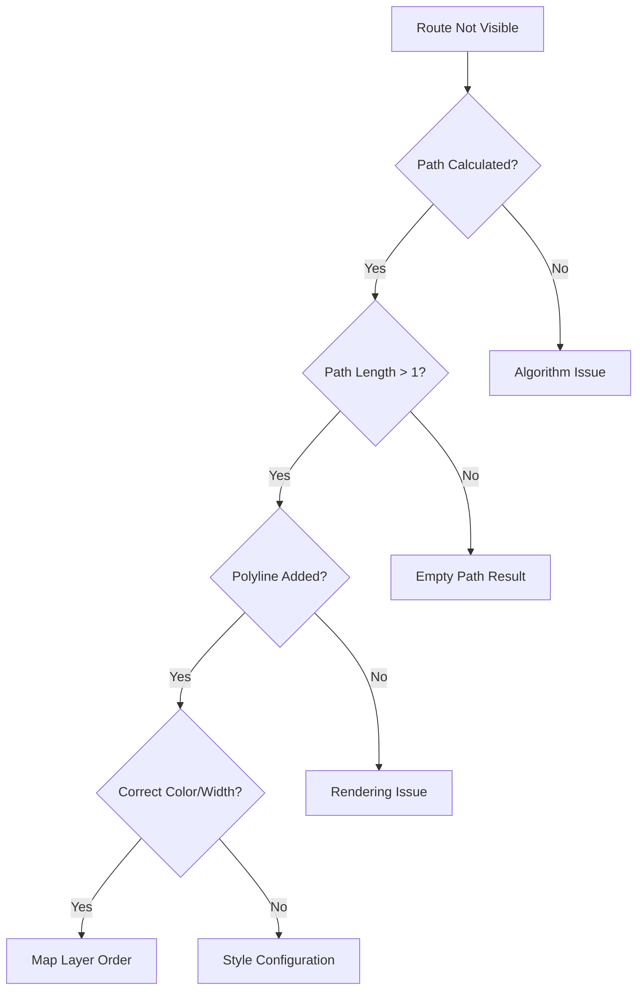
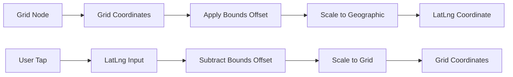
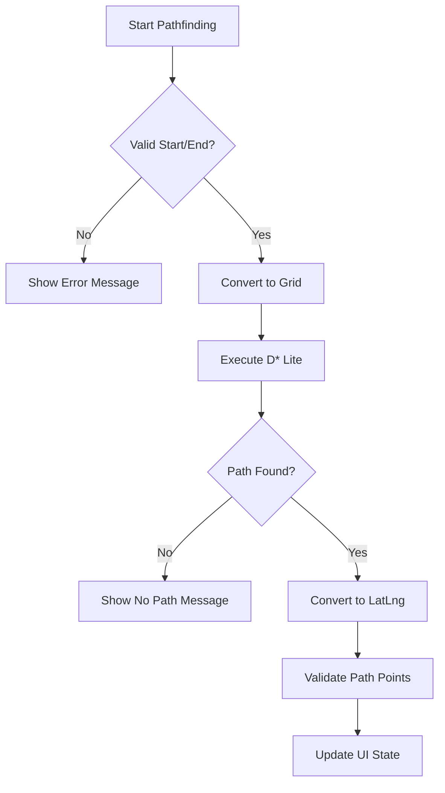
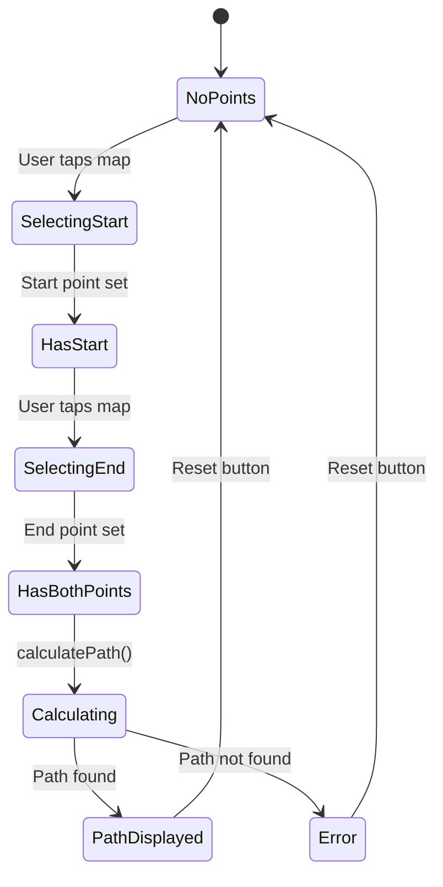

# Route Visualization Enhancement Design

## Overview

This document outlines the design for enhancing the route visualization system in the IMU step counting mobile application. The current implementation calculates routes using the D* Lite algorithm but fails to properly display the computed path in blue between start and end points.

## Technology Stack & Dependencies

- **Framework**: Flutter with Dart
- **Map Rendering**: flutter_map package with flutter_map/flutter_map.dart
- **Coordinate System**: latlong2/latlong.dart for LatLng coordinates
- **Path Algorithm**: Custom D* Lite implementation in `algorithms/d_star_lite.dart`
- **State Management**: StatefulWidget with custom controllers
- **Background Processing**: Isolates for path calculation performance

## Architecture

### Component Hierarchy



### Data Flow Architecture



## Core Issues Analysis

### Current Route Visualization Problems

1. **Path Display Failure**: Blue route not appearing despite successful path calculation
2. **State Synchronization**: Disconnect between calculated path and UI rendering
3. **Grid Coordinate Conversion**: Potential issues in Node to LatLng conversion
4. **Polyline Rendering**: Problems in _buildSafePolylines() method
5. **Performance Bottlenecks**: Heavy computation blocking UI updates

### Root Cause Assessment



## Route Visualization Components

### Path Calculation Engine

**Component Definition**
- Handles coordinate system conversions between LatLng and grid positions
- Manages D* Lite algorithm execution through background processing
- Provides safe state management for asynchronous path computation

**Key Responsibilities**
- Convert user tap coordinates to grid positions
- Execute pathfinding algorithm in background isolate
- Transform node-based path back to geographic coordinates
- Handle path validation and error scenarios

### Visual Rendering System

**Polyline Rendering Architecture**
```dart
// Enhanced polyline rendering structure
List<Polyline> _buildSafePolylines() {
  List<Polyline> polylines = [];
  
  // Primary route polyline - highest priority
  if (path.isNotEmpty && path.length > 1) {
    polylines.add(Polyline(
      points: path,
      color: Colors.blue,
      strokeWidth: 4.0,
      isDotted: false,
      pattern: StrokePattern.solid,
    ));
  }
  
  // Grid lines - lower priority
  if (_initContext.gridInitialized) {
    polylines.addAll(buildOptimizedGridLines());
  }
  
  return polylines;
}
```

**Layer Rendering Order**
1. Background map overlay (lowest)
2. Grid lines 
3. Route polylines (blue path)
4. Polygons (start/end highlights)
5. Markers (highest priority)

### Coordinate System Integration

**Grid-to-Geographic Conversion**


## Route Calculation Enhancement

### Algorithm Integration

**D* Lite Path Computation**
- Implements incremental pathfinding for dynamic obstacle handling
- Maintains consistency between grid-based computation and geographic display
- Optimizes performance through background isolate execution

**Path Validation Logic**


### Background Processing Architecture

**Isolate Communication Structure**
- Path calculation executes in separate isolate to prevent UI blocking
- Maintains responsive user interface during complex pathfinding
- Provides progress feedback and error handling

## UI State Management

### Path Display State

**State Variables**
- `List<LatLng> path` - Current calculated route coordinates
- `LatLng? startPoint` - User-selected starting position
- `LatLng? goalPoint` - User-selected destination
- `bool selectingStart` - UI mode for point selection

**State Transition Flow**


### Visual Feedback System

**Loading States**
- Display "Calculando ruta..." message during computation
- Show progress indicators for long-running calculations
- Provide visual feedback for successful/failed path computation

**Error Handling**
- Handle same start/end point selection
- Manage unreachable destination scenarios
- Display meaningful error messages to user

## Performance Optimization

### Rendering Performance

**Optimization Strategies**
- RepaintBoundary widgets for expensive rendering operations
- Level-of-detail (LOD) system for grid line density
- Viewport culling for off-screen elements
- Polyline culling for improved performance

**Memory Management**
- Efficient coordinate list management
- Proper disposal of animation controllers
- Background processor resource cleanup

### Computational Efficiency

**Background Processing**
- Isolate-based path calculation prevents UI freezing
- Chunked data processing for large grids
- Optimized grid traversal algorithms

## Testing Strategy

### Unit Testing

**Core Algorithm Testing**
- D* Lite pathfinding correctness
- Coordinate conversion accuracy
- Grid boundary validation
- Path reconstruction integrity

### Integration Testing

**Route Visualization Testing**
- End-to-end path calculation and display
- Multi-scenario route testing
- Performance benchmarking
- Error condition handling

### UI Testing

**Visual Verification**
- Blue polyline visibility confirmation
- Correct path rendering between points
- Marker placement accuracy
- Layer rendering order validation

## Implementation Roadmap

### Phase 1: Core Route Display Fix
1. **Polyline Rendering Repair**
   - Verify path data structure integrity
   - Ensure proper color and width settings
   - Fix layer rendering order issues

2. **State Management Enhancement**
   - Improve path state synchronization
   - Add comprehensive error handling
   - Implement proper state validation

### Phase 2: Visual Enhancement
1. **Route Styling Improvements**
   - Enhanced blue route visibility
   - Route endpoint highlighting
   - Alternative route visualization

2. **User Experience Optimization**
   - Improved loading feedback
   - Better error messages
   - Smooth animations for route appearance

### Phase 3: Performance Optimization
1. **Rendering Performance**
   - Advanced viewport culling
   - Optimized polyline rendering
   - Memory usage optimization

2. **Algorithm Efficiency**
   - Path calculation optimization
   - Grid traversal improvements
   - Background processing enhancement