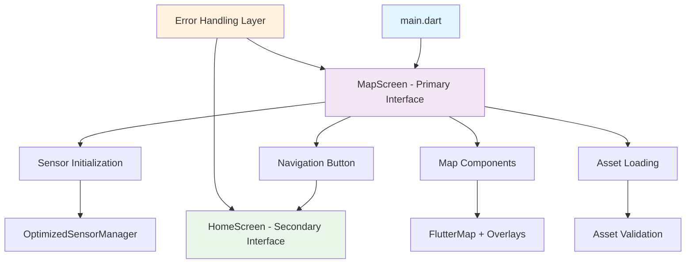

# Fix Application Startup Errors - Flutter IMU Step Counter App

## Overview
This document provides a comprehensive solution to fix multiple startup errors in the Flutter IMU step counter application. The app consists of a main map interface ([map_screen.dart](file://c:\Users\ASUS\OneDrive\OneDrive%20-%20unicauca.edu.co\Escritorio\Trabajo%20de%20grado\PSNEOPEI\app-conteo-de-pasos-proyecto_imu_v1_3\app-conteo-de-pasos-proyecto_imu_v1_3\lib\screens\map_screen.dart)) and a secondary home interface ([home_screen.dart](file://c:\Users\ASUS\OneDrive\OneDrive%20-%20unicauca.edu.co\Escritorio\Trabajo%20de%20grado\PSNEOPEI\app-conteo-de-pasos-proyecto_imu_v1_3\app-conteo-de-pasos-proyecto_imu_v1_3\lib\screens\home_screen.dart)) accessible via a button navigation.

## Identified Critical Issues

### 1. Package Name Mismatch
- **Problem**: Import statements reference `proyecto_imu_v1_2` but the actual package name is `proyecto_imu_v1_3`
- **Impact**: All internal imports fail, preventing compilation
- **Files Affected**: 25+ files containing incorrect import statements

### 2. Missing Asset References
- **Problem**: Code references `assets/planta1.jpg` which exists but may have path issues
- **Impact**: Map overlay image loading failures

### 3. Sensor Initialization Errors
- **Problem**: Multiple sensor managers and potential initialization race conditions
- **Impact**: App crashes during sensor startup

### 4. Null Safety and Error Handling Issues
- **Problem**: Insufficient null checks and error handling in critical components
- **Impact**: Runtime crashes when components fail to initialize

## Solution Architecture



## Critical Fixes Required

### Fix 1: Package Name Correction
**Priority: CRITICAL**

Update all import statements from `proyecto_imu_v1_2` to `proyecto_imu_v1_3`:

| File Category | Files to Update | Pattern |
|---------------|-----------------|---------|
| Controllers | `home_controller.dart` | All internal imports |
| Screens | `home_screen.dart` | Widget and controller imports |
| Sensors | `conteopasostexteo.dart`, `sensor_processor.dart`, `sensor_manager.dart` | Data processing imports |
| Widgets | All widget files | Internal references |

### Fix 2: Asset Path Validation
**Priority: HIGH**

Implement robust asset loading with fallbacks:

```dart
// Asset validation pattern
bool _shouldShowMapImage() {
  try {
    // Validate asset existence before loading
    return assetExists('assets/planta1.jpg');
  } catch (e) {
    debugPrint('Asset validation failed: $e');
    return false;
  }
}
```

### Fix 3: Sensor Manager Consolidation
**Priority: CRITICAL**

Remove conflicting sensor manager instances:
- Keep `OptimizedSensorManager` as primary
- Remove redundant `SensorManager` references
- Implement proper disposal pattern

### Fix 4: Enhanced Error Handling
**Priority: HIGH**

Implement comprehensive error boundaries:

```dart
// Error handling pattern
Widget _buildSafeComponent() {
  try {
    return _actualComponent();
  } catch (e) {
    debugPrint('Component error: $e');
    return _errorFallbackWidget(e);
  }
}
```

## Implementation Steps

### Phase 1: Package Name Fixes (IMMEDIATE)
1. **Global Search and Replace**: Change all `proyecto_imu_v1_2` to `proyecto_imu_v1_3`
2. **Verify Import Paths**: Ensure all relative imports are correct
3. **Test Compilation**: Run `flutter clean && flutter pub get`

### Phase 2: Asset and Navigation Fixes
1. **Asset Loading**: Implement asset existence checks
2. **Navigation Flow**: Ensure button navigation works correctly
3. **Map Initialization**: Add progressive loading with fallbacks

### Phase 3: Sensor Integration
1. **Manager Consolidation**: Remove duplicate sensor managers
2. **Initialization Order**: Implement proper startup sequence
3. **Error Recovery**: Add sensor failure recovery mechanisms

### Phase 4: UI Safety Improvements
1. **Null Safety**: Add comprehensive null checks
2. **Loading States**: Implement proper loading indicators
3. **Error UI**: Add user-friendly error messages

## Error Recovery Patterns

### Pattern 1: Progressive Initialization
```dart
Future<void> _initializeMapComponents() async {
  _initContext.reset();
  
  // Critical components first
  await _initializeGridMetrics();
  
  // Optional components with error handling
  try {
    await _initializeSensors();
  } catch (e) {
    _initContext.addError('Sensors unavailable: $e');
  }
}
```

### Pattern 2: Safe Widget Building
```dart
Widget _buildSafeFlutterMap() {
  if (!_initContext.hasMinimalRequirements) {
    return _buildInitializationErrorUI();
  }
  
  try {
    return FlutterMap(/* configuration */);
  } catch (e) {
    return _buildMapErrorUI(e.toString());
  }
}
```

### Pattern 3: Fallback Navigation
```dart
void _navigateToHome() {
  try {
    Navigator.push(
      context,
      MaterialPageRoute(builder: (context) => const HomeScreen()),
    );
  } catch (e) {
    ScaffoldMessenger.of(context).showSnackBar(
      SnackBar(content: Text('Navigation error: $e')),
    );
  }
}
```

## Testing Strategy

### Unit Tests
- Sensor manager initialization
- Asset loading validation
- Navigation flow verification

### Integration Tests
- Map screen to home screen navigation
- Sensor data flow
- Error state handling

### Device Testing
- Physical device sensor functionality
- Performance under various conditions
- Memory usage optimization

## Expected Outcomes

### Before Fixes
- ❌ Compilation failures due to package name mismatch
- ❌ Runtime crashes during sensor initialization
- ❌ Navigation button failures
- ❌ Asset loading errors

### After Fixes
- ✅ Clean compilation with no import errors
- ✅ Stable sensor initialization with error recovery
- ✅ Smooth navigation between map and home screens
- ✅ Robust asset loading with fallbacks
- ✅ Comprehensive error handling throughout the app

## Risk Mitigation

### High Priority Risks
1. **Sensor Hardware Dependency**: Implement fallback modes when sensors unavailable
2. **Memory Leaks**: Ensure proper disposal of all resources
3. **Performance Issues**: Add performance monitoring and optimization

### Medium Priority Risks
1. **Asset Compatibility**: Validate assets across different screen densities
2. **Navigation State**: Maintain proper navigation stack management
3. **Data Persistence**: Ensure sensor data saving works correctly

## Maintenance Guidelines

### Code Quality
- Maintain consistent error handling patterns
- Use proper null safety throughout
- Document all sensor initialization steps

### Monitoring
- Track sensor initialization success rates
- Monitor navigation performance
- Log asset loading failures

### Updates
- Regular dependency updates
- Sensor library compatibility checks
- Performance optimization reviews