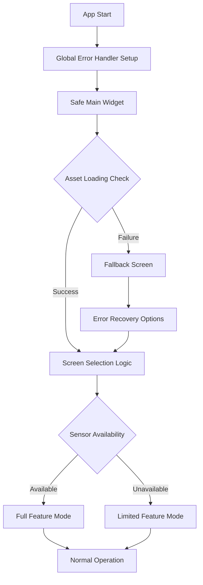
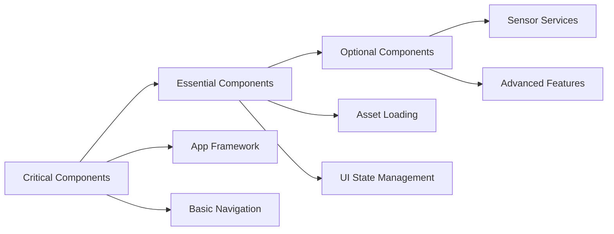

# Flutter IMU App Black Screen and Crash Fix Design

## Overview

The Flutter IMU step counting application is experiencing critical initialization issues that cause black screens and crashes during startup. After analyzing the codebase, several critical problems have been identified that require immediate fixes to ensure proper application startup and stability.

## Problem Analysis

### Critical Issues Identified

1. **Missing dart:async Import in main.dart**
   - The app uses `runZonedGuarded` without importing `dart:async`
   - This causes immediate runtime exceptions during app initialization

2. **Custom runZonedGuarded Implementation**
   - A custom implementation overwrites the built-in function
   - Doesn't properly handle async operations and zone management
   - Missing proper error propagation and zone handling

3. **Asset Loading Vulnerabilities**
   - MapScreen tries to load assets without proper error handling
   - Missing assets can cause immediate crashes during initialization
   - No fallback mechanisms for missing or corrupted assets

4. **Complex Initialization Dependencies**
   - MapScreen has heavy initialization logic that can fail
   - Multiple dependent services (sensors, POIs, obstacles) without proper error isolation
   - No graceful degradation when optional components fail

5. **Widget Build Safety Issues**
   - Insufficient null checks and validation in widget build methods
   - Risk of null reference exceptions during widget initialization

## Architecture

### Error Handling Flow

### Component Initialization Strategy

## Technical Implementation

### 1. Main Application Entry Point Fixes

**Issues to Fix:**
- Add missing `dart:async` import
- Remove custom `runZonedGuarded` implementation
- Implement proper zone-based error handling
- Add app lifecycle error recovery

**Required Changes:**
- Import `dart:async` library
- Use built-in `runZonedGuarded` function
- Implement proper error boundaries
- Add app restart mechanisms

### 2. Asset Loading Safety Implementation

**Safety Mechanisms:**
- Pre-validate all required assets during app startup
- Implement asset loading retry logic with exponential backoff
- Create fallback UI components for missing assets
- Add asset integrity validation

**Asset Validation Flow:**
1. Check asset existence before loading
2. Validate asset format and integrity
3. Provide default/fallback assets for missing files
4. Log asset loading status for debugging

### 3. Progressive Screen Initialization

**Initialization Phases:**
1. **Phase 1 (Critical)**: Basic app framework and navigation
2. **Phase 2 (Essential)**: UI components and basic functionality
3. **Phase 3 (Optional)**: Advanced features like sensors and maps

**Error Isolation Strategy:**
- Each phase has independent error handling
- Failure in optional phases doesn't affect critical functionality
- Graceful degradation with user notification

### 4. Safe Widget Building Patterns

**Implementation Requirements:**
- Null-safe widget construction
- Validation before data access
- Error boundaries for complex widgets
- Loading states for async operations

### 5. Sensor Service Resilience

**Robustness Features:**
- Sensor availability detection before initialization
- Fallback modes for missing sensors
- Service restart mechanisms for sensor failures
- User notification for sensor-dependent features

### 6. Memory and Performance Safety

**Optimization Strategies:**
- Lazy loading for heavy components
- Proper resource cleanup and disposal
- Memory usage monitoring
- Background processing management

## Error Recovery Mechanisms

### 1. Application Level Recovery

**Recovery Options:**
- Automatic app restart with different initialization strategy
- Safe mode with minimal features
- User-initiated recovery actions
- Debug information collection

### 2. Component Level Recovery

**Recovery Strategies:**
- Component restart with fallback configuration
- Alternative service providers
- Feature degradation with user notification
- Manual retry mechanisms

### 3. User Experience During Errors

**UX Improvements:**
- Clear error messages in Spanish (user's language)
- Recovery action buttons
- Progress indicators during recovery
- Context-sensitive help information

## Testing Strategy

### 1. Initialization Testing

**Test Scenarios:**
- Cold app startup with all assets present
- Startup with missing assets
- Startup with sensor unavailability
- Startup with network connectivity issues
- Memory pressure scenarios

### 2. Error Handling Testing

**Test Cases:**
- Verify error boundaries catch all exceptions
- Test recovery mechanisms work correctly
- Validate fallback UIs display properly
- Ensure no data loss during errors

### 3. Performance Testing

**Performance Metrics:**
- App startup time under various conditions
- Memory usage during initialization
- Battery impact of background services
- UI responsiveness during heavy operations

## Implementation Priority

### High Priority (Critical Fixes)
1. Fix missing `dart:async` import in main.dart
2. Replace custom `runZonedGuarded` with proper implementation
3. Add asset validation and fallback mechanisms
4. Implement safe widget building patterns

### Medium Priority (Stability Improvements)
1. Progressive screen initialization
2. Sensor service resilience
3. Memory and performance optimizations
4. Enhanced error recovery mechanisms

### Low Priority (User Experience)
1. Improved error messages and UI
2. Advanced debugging capabilities
3. Performance monitoring dashboard
4. User preference persistence during errors

## Success Criteria

### Primary Goals
- App launches successfully on all target devices
- No black screens during normal startup sequence
- Graceful handling of missing assets or services
- User can access core functionality even with partial failures

### Secondary Goals
- Fast startup times (< 3 seconds to first screen)
- Clear error communication to users
- Automatic recovery from transient issues
- Comprehensive error logging for debugging

### Quality Assurance
- Zero crash rate during normal startup sequence
- Successful initialization in 95% of test scenarios
- User satisfaction with error handling experience
- Maintainable and debuggable error handling code